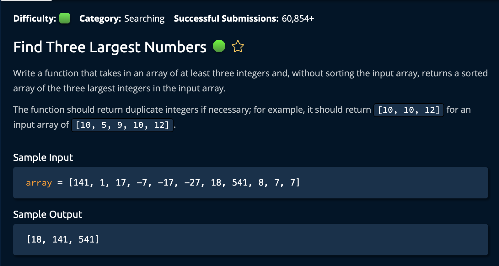

# FindThreeLargestNumbers

## Description



## Solution

```py
def findThreeLargestNumbers(array):
    threeLargest = [None] * 3

    for num in array:
        if threeLargest[2] is None or num > threeLargest[2]:
            shiftAndUpdate(threeLargest, num, 2)
        elif threeLargest[1] is None or num > threeLargest[1]:
            shiftAndUpdate(threeLargest, num, 1)
        elif threeLargest[0] is None or num > threeLargest[0]:
            shiftAndUpdate(threeLargest, num, 0)
    return threeLargest

# Helper Function: shifts smaller elements to the left if new number is added to array
def shiftAndUpdate(array, num, idx):
    for i in range(idx + 1):
        if i == idx:
            array[i] = num
        else:
            array[i] = array[i+1]

```

**Time Complexity:** O(n) for iterating through the array<br/>
**Space Complexity:** O(1)<br/>

1. First, we initialize an array of size 3 with the value of "None" called `threeLargest`, this will be used to hold our 3 largest numbers <br/>

```py
threeLargest = [None] * 3
```

2. Then, we iterate through the input array. At each index, we check if `num` is larger than `threeLargest[2]`, `threeLargest[1]` then `threeLargest[0]`. If any of those conditions are true, we call the **shiftAndUpdate()** function.

### How shiftAndUpdate() Works:

It starts from the first index of the array and sets its value to the following index, unless the current observed index is equal to the `Targetidx`. If so, it updates its value. <br>

Keep in mind if the `Targetidx` = 0, no values will be shifted, if `Targetidx` = len(array) then all values excepet the last index will be shifted.<br>

And were **Done**!
