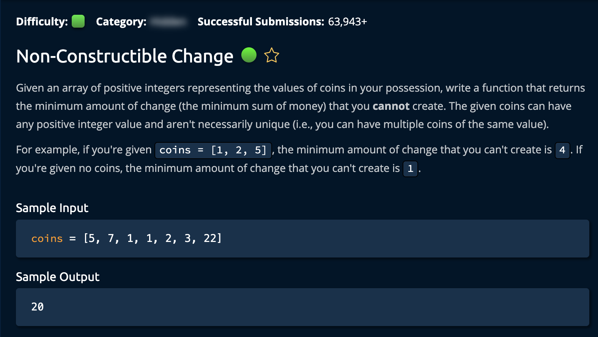

# Non-Constructible Change

## Description



## Solution 1

**Time Complexity:** O(nlogn)  
**Space Complexity:** O(1) <br/>
First, after sorting the list, we iterate through each element. For every new coin we add to the total, there is a formula to consider: <br/>

```
if coin > change + 1:
    we cannot create that amount of change
```

if `coin > change + 1` we return `change + 1` because `change` is the largest amount we **can** create.<br/>

## Notes: BASE CASE

If the first number of the array is not one, then the smallest change we cannot create is 1. However this implementation takes care of that case.

### Non-Optimal Solution

1. Starting from 1, go through the array and check every combination and see if you can create that change
2. Once a combination is found for anumber `1..k`, return that number
