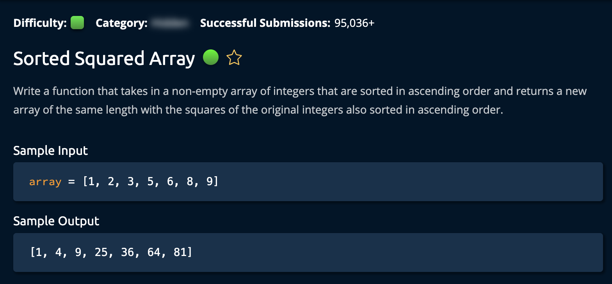

# Sorted Squared Array

## Description

## Solution 1

**Time Complexity:** O(n)  
**Space Complexity:** O(n)  
Since the numbers are sorted, we know that the left most number(if it is negative) has the highest absolute value, andthe right most number(if it is positive) has the lowest absolute value.  

The algorithm starts at both ends of the array and comapres the absolute values, whichever one is larger, it selects that index, squares it and places it at the largest(rightmost) index in the new array. 

As the algorithm contionues the pointers move closer to the center of the array, once they cross each other, the algorithm will return the new array.

## Solution 2 (Non-Optimal)

**Time:** O(nlogn + n)sorting + squaring
**Space:** O(n)

1. Create a new array of size n.
2. iterate through input array
3. square each value and place it it the corresponding index of hte new array
