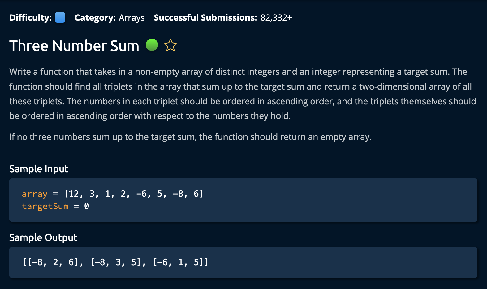

# ThreeNumberSum

## Description



## Solution

```py
def threeNumberSum(array, targetSum):
    result = []
    array.sort()  # nlogn time
    for i in range(len(array) - 2):
        left = i + 1
        right = len(array) - 1
        while left < right:
            currentSum = array[i] + array[left] + array[right]
            if currentSum == targetSum:
                result.append([array[i], array[left], array[right]])
                left += 1
                right -= 1
            elif currentSum < targetSum:
                left += 1
            elif currentSum > targetSum:
                right -= 1

    return result
```

**Time Complexity:** O(n^2) for the nested while loop<br/>
**Space Complexity:** O(n) for the 2D `result` array <br/>

1. First, we initialize our function return value as an empty list called `result`. Then we sort out input array. (This is done to implement a common left and right pointer technique)

```py
result = []
array.sort()  # nlogn time
```

#### How The Two-Pointer Technique Works:

The _Two-Pointer Technique_ is commonly used in problems involving sorted arrays to find a set of elements that meet certain criteria. For our case: summing up to a target value.

2. Now, We iterate through the input array, setting the `left` pointer to one index ahead of the currently observed value `i`. The `right` pointer is set to the last index of the array.

```py
left = i + 1
right = len(array) - 1
```

3. We then create a while loop that continues until the pointers cross each other. After this we calcualte the `currentSum` by adding the values at the `i`, `left`, and `right` pointers.

```py
while left < right:
    currentSum = array[i] + array[left] + array[right]
```

4. Continuing in the body fo the while loop, we check if the `currentSum` is equal to the `targetSum`. If so, we append an array of the `currentSum` values to out `results` list. _Remember this is a 2D array_

```py
if currentSum == targetSum:
    result.append([array[i], array[left], array[right]])
    left += 1
    right -= 1
```

Since the input array is **sorted**. We can increment the `left` and decrement the `right` pointers simultaniously because we _know_ the current value is equal to the target. If we only move one pointer, it is garunteed that the calue will either _increase_, or _decrease_ past the `targetSum`.

5. If the `currentSum` is less than the `targetSum`, we increment the `left` pointer. If it is greater than the `targetSum`, we decrement the `right` pointer.

Again, since the arinput arrayray is **sorted**, we know that moving `left` will increase the currentSum and moving `right` will decrease the currentSum.

```py
elif currentSum < targetSum:
    left += 1
elif currentSum > targetSum:
    right -= 1
```

Finally, we return the 2D `result` array, and we're **Done**! <br>

### Note

This entire while loop is _inside_ a for loop so it will run `n` times. After each for loop, i moves closer and closer to the end of the array. Since we are also cheking the values `left` and `right`. It is important that the for loop stops at `len(array) - 2` so that `left` and `right` do not fall out of range.
