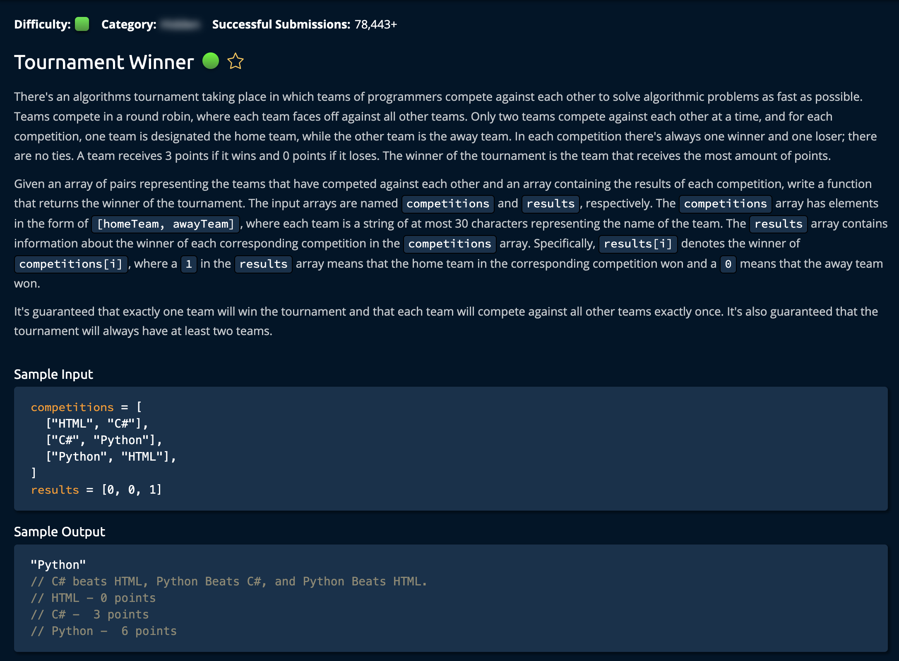

# Tournament Winner

## Description



## Solution 1

**Time: O(n)** (Number of Tournaments) <br/>
**Space: O(k)** (Number of Teams) <br/>
Iterate through the `Competitions Array` using:

```
for idx, competition in enumerate(competitions):
```

**idx** is the index of competition and **competitions** is a 2D Array `[hometeam, awayteam]`. <br/>

The Algorithm loops through and determines which team won the tournament based on the equivalent index on the results array.

```
0 = Away Team Won
1 = Home Team Won
```

After Finding the winning team it inserts it into a hashtable `scores{team: score}` using a method called **updateScores**.<br/>

Note that `competitions` and `results` are the same size.
