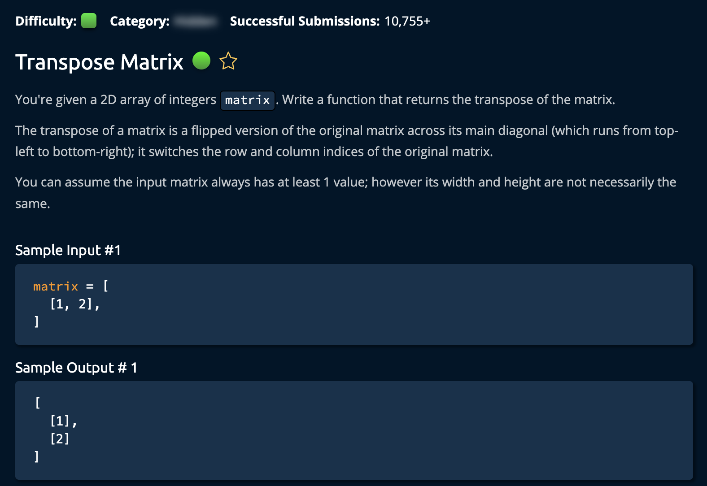

# Transpose Matrix

## Description



## Solution 1

**Time Complexity:** O(l x w)
**Space Complexity:** O(l x w) <br/>
Loop through every `column` in the range, create a new `row`(array) and add it to a new `matrix` called **transposedMatrix**<br/>

## Notes: How For Loops Work

```py
matrix = [
    [1, 2, 3],
    [4, 5, 6],
    [7, 8, 9]
]
```

```py
for col in range(len(matrix[0])):
retrieves the number of columns in the first row [1, 2, 3]

for row in range(len(matrix)):
retrieves the number of rows in the matrix [1, 4, 7]
```

```c++
newRow.append(matrix[row][col]) -> the current index being iterated over is added to newRow
```
