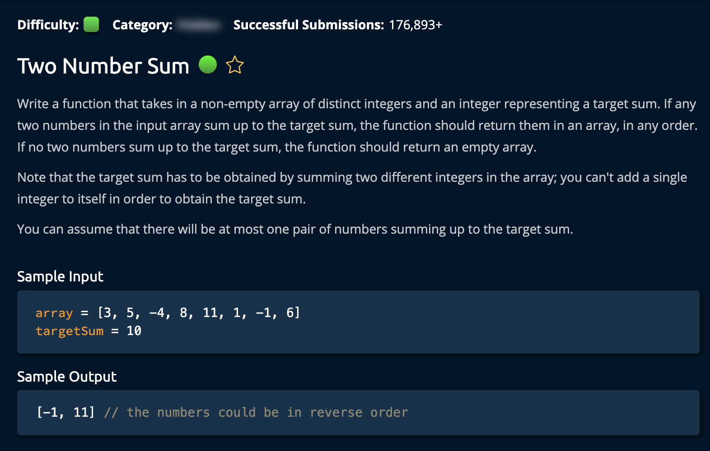

# Validate Subsequence

**Time Complexity:** O(n)  
**Space Complexity:** O(n) because of the hashtable

## Description



## Solution 1

Create a **Hashtable** that will hold all the numbers that have been visited already. This allows us to use a particular formula. <br/>

```
x + y = TargetSum
x = the current value in the array
y = TargetSum - x: which is the currently obsrved number n the array minus the TargetSum
```

At each point in the for loop, the algorithm cehcks if the `y` is in the hashtable. If it is, the algorithm returns `True`. Otherwise, it adds the `x`, the currenlt viewed number, to the hashtable.

- If, `y` is in the hashtable then we have found our match and it returns true
- If, `y` is not in the hashtable then we add the `x` to the hashtable and continue the loop

## Solution 2

To enhance efficiency, the algorithm performs an initial check to compare the lengths of the array and the sequence. If the array is shorter than the sequence, it immediately returns `False`, avoiding unnecessary computations.
