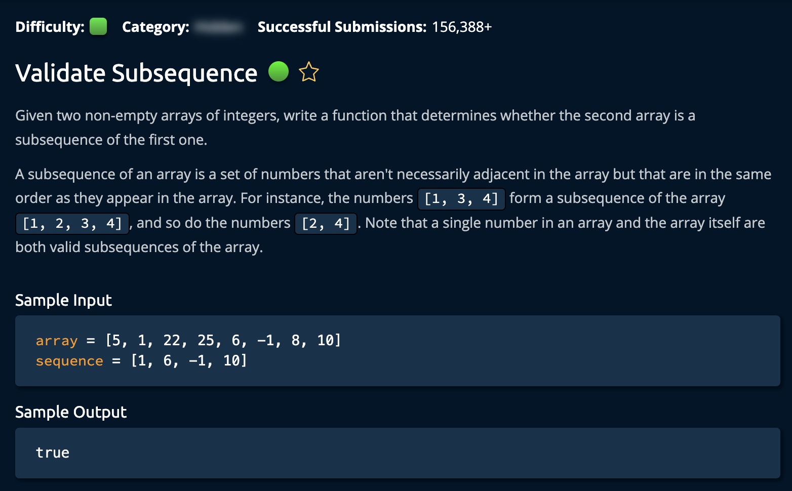

# Validate Subsequence

**Time Complexity:** O(n)  
**Space Complexity:** O(1)

## Description

## Solution

The algorithm employs a simple pointer (`seqPointer`) initialized at the start of the sequence. It iterates through each element of the array, checking if the current array element (`array[x]`) matches the current target element in the sequence (`sequence[seqPointer]`). If a match is found, `seqPointer` is incremented to move to the next target element in the sequence.

- If, at any point, `seqPointer` equals the length of the sequence, the algorithm concludes that the sequence is a valid subsequence of the array and returns `True`.
- If the loop completes and `seqPointer` has not reached the end of the sequence, it indicates that not all elements of the sequence were found in the array, and the algorithm returns `False`.

## Pointers

To enhance efficiency, the algorithm performs an initial check to compare the lengths of the array and the sequence. If the array is shorter than the sequence, it immediately returns `False`, avoiding unnecessary computations.
