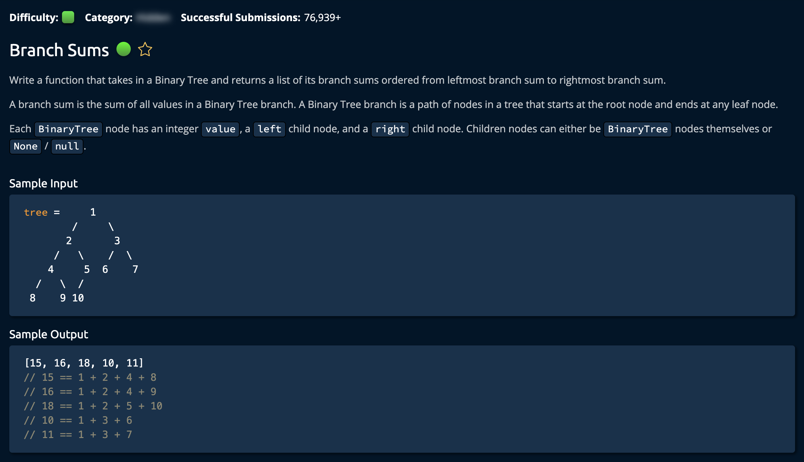

# Branch Sums

## Description



## Solution (Recursive)

```py
def branchSums(root):
    sums = []
    branchSumsHelper(root, 0, sums)
    return sums


def branchSumsHelper(node, branchSum, sums):
    if node is None:
        return

    branchSum += node.value
    if node.left is None and node.right is None:  # Base case
        sums.append(branchSum)
        return

    branchSumsHelper(node.left, branchSum, sums)
    branchSumsHelper(node.right, branchSum, sums)
```

**Time: O(n)** For Visiting Every Node in the Tree<br/>
**Space: O(n)** `n`: worst case for unbalanced tree, `logn`: average case for balanced tree<br/>

1. Initialize an empty Branch Sums array, and create Helper function. The `sums` array will be passed along in the recursive calls.

```py
sums = []
branchSumsHelper(root, 0, sums)
```

- `root` is the root node of the tree
- `branchSum`(initialized to 0) is the accumulated sum of the current branch
- `sums` is the array that will contain all the branch sums

2. Create a **base case** for Nodes with `one child`:

```py
if node is None:
        return
```

3. Crease another **base case** for the recursive call: if the algorithm reaches a `leaf node`

```py
branchSum += node.value
if node.left is None and node.right is None:
        sums.append(branchSum)
        return
```

The algorithm starts at the root node and adds its value to an accumilating `branchSum`(branchSum += node.value). If the current node is a leaf, it appends the accumilated sum to the list and ends that recursive call.<br/>

The Traversal through the tree is accomplished by these recursive calls:

```py
branchSumsHelper(node.left, branchSum, sums)
branchSumsHelper(node.right, branchSum, sums)
```

- the accumilating `branchSum` is passed along in the recursive calls
- the `sums` array is passed along in the recursive calls
- `node.left` and `node.right` is how the algorithm traverses the tree

### Note

Binary Tree Class was given by the question:

```py
# This is the class of the input tree. Do not edit.
class BST:
    def __init__(self, value):
        self.value = value
        self.left = None
        self.right = None
```
