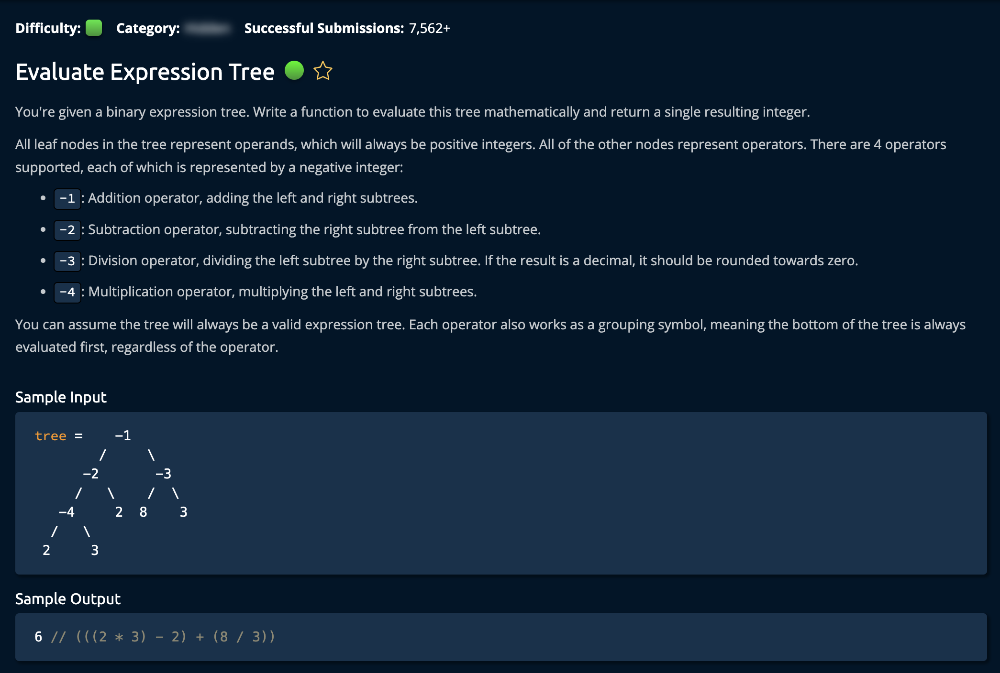

# Evaluate Expressions Tree

## Description



## Solution 1 (Recursive) - No Helper Function

**Time: O(n)** <br/>
**Space: O(h) height of tree** <br/>

1. Create Helper function:

```py
branchSumsHelper(root, 0, sums)
```

2. Crease a **base case** for the recursive call: if the algorithm reaches a leaf node

```py
if node.left is None and node.right is None:
```

3. Crease a another **base case** for Nodes with `one child`:

```py
if node is None:
        return
```

The algorithm starts at the root node and adds its value to an accumilating sum(`branchSum`). It then checks at each node if it is a leaf. If TRUE, it appends the accumilated sum to the list and returns.(`sums.append(branchSum)`) <br/>

It Iterates through the tree like so:

```py
branchSumsHelper(node.left, branchSum, sums)
branchSumsHelper(node.right, branchSum, sums)
```

### Note

<br/>

Binary Tree Class was given:

```py
# This is the class of the input tree. Do not edit.
class BST:
    def __init__(self, value):
        self.value = value
        self.left = None
        self.right = None
```
