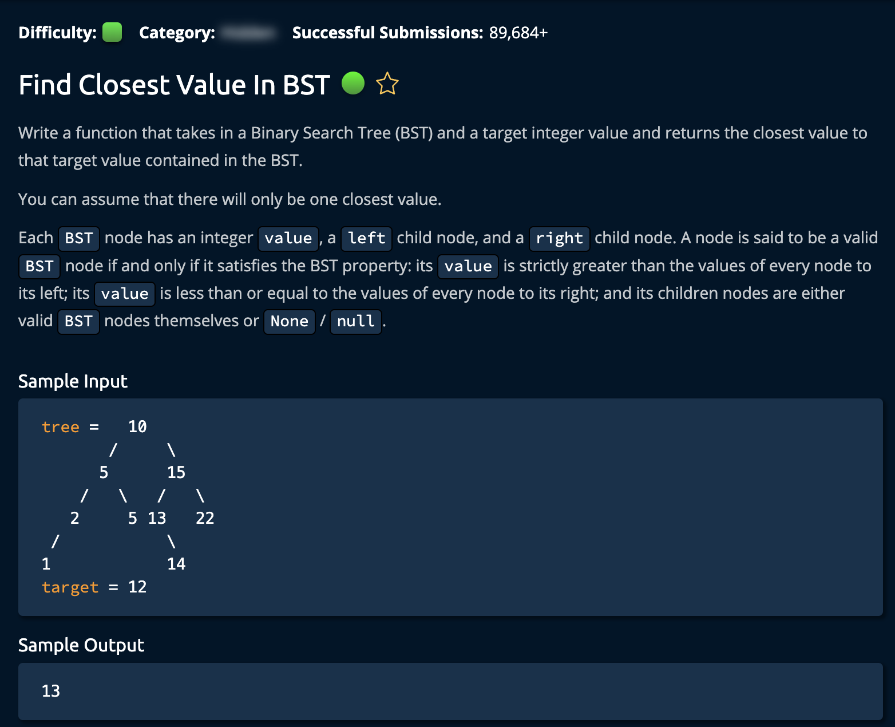

# Find Closest Value in BST

## Description



## Solution 1 (Recursive)

**Time: O(logn) Average Case | O(n) Worst Case** <br/>
**Space: O(logn)** <br/>

1. Create Helper function:

```py
findClosestValueInBstHelper(tree, target, float("inf"))
```

2. Crease a **base case** for the recursive call:

```py
if tree is None:  # Base Case
        return closest
```

The algorithm comapres the absolute differnece of the `target` and the `current node`. It assigns the closer one to variable `closest` and calls the function again on the left or right subtree dpeending on if the target is larger or smaller than the current node value. <br/>

```py
if target > tree.value:
        return findClosestValueInBstHelper(tree.right, target, closest)
    elif target < tree.value:
        return findClosestValueInBstHelper(tree.left, target, closest)
    else:
        return closest
```

Also, if the value is equal then we end the recursion, because we found an equal node.

### Note

Binary Tree Class was given:

```py
# This is the class of the input tree. Do not edit.
class BST:
    def __init__(self, value):
        self.value = value
        self.left = None
        self.right = None
```

## Optimal Solution 2 (Iterative)

**Time: O(logn) Average Case | O(n) Worst Case** <br/>
**Space: O(1)** <br/>

1. Create `while loop` to end at the leaf of the tree

```py
while currentNode is not None:
```

note: Similar logic to `Solution 1` but instead of recursive valls, we traverse through the tree.

```py
if target > currentNode.value:
            currentNode = currentNode.right
        elif target < currentNode.value:
            currentNode = currentNode.left
        else:
            return closest
```
