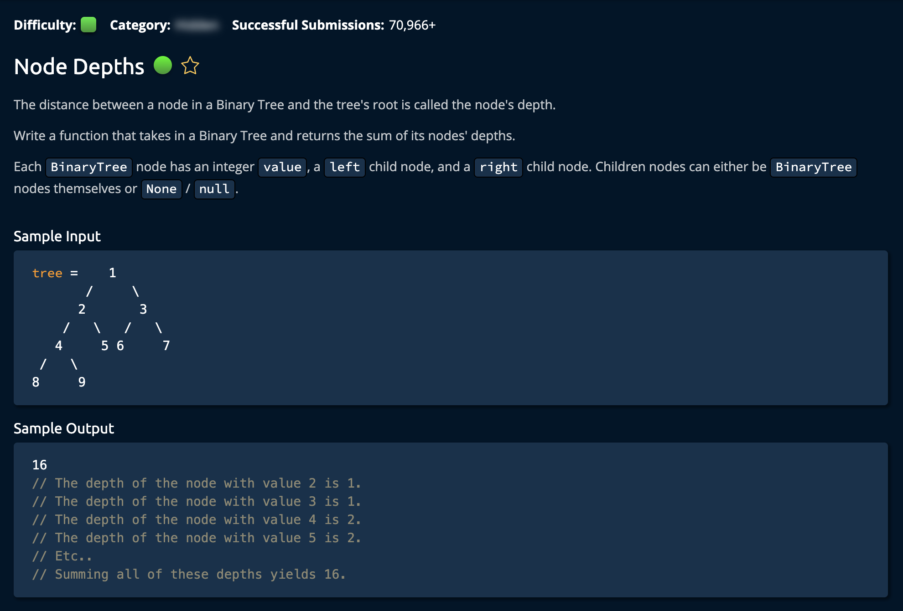

# Node Depth

## Description



## Solution 1 (Recursive)

**Time: O(n)** <br/>
**Space: O(h) `h` is Hight of the Tree** <br/>

1. Create a helper function(optional):

```py
nodeDepthHelper(root, sums = 0)
```

The `sums = 0` sets a default value for sums. Removing this would cause the algorithm to fail(it would still compile). Placing `sums = 0` or just putting `0` as the second parameter would suffice.

2. Create base case:

```py
if root is None:
        return 0
```

this ensures that the algorithm doesn't crash when it reaches a leaf node.

3. Return the sum of the current node's value and the sum of the left and right subtrees:

```py
return sums + nodeDepthHelper(root.left, sums + 1) + nodeDepthHelper(root.right, sums + 1)
```

`sums` is the depth of the current node. The `first` and `second` recursive calls return the accumilated depth of the left subtree and the righrt respectively. <br/>

### Note

This works with a node of 1 value or 2 or 3 because of teh base case. <br/>

```py
# This is the class of the input tree. Do not edit.
class BST:
    def __init__(self, value):
        self.value = value
        self.left = None
        self.right = None
```
