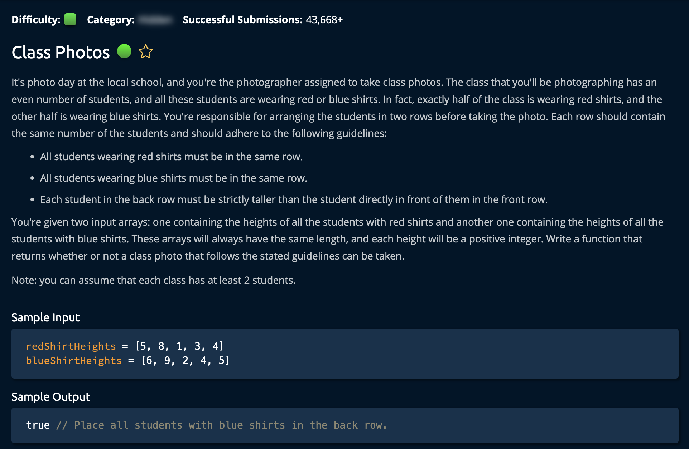

# ClassPhotos

## Description



## Solution 1

**Time: O(nlogn) Sorting** <br/>
**Space: O(1)** <br/>

1. Sort The two arrays:

```py
# Sorted in reverse for convenience of selecting the tallest person
redShirtHeights.sort(reverse=True)
blueShirtHeights.sort(reverse=True)
```

The algorithm determines the first row based on which color has the tallest eprson in the class. The tallest person's shirt color dictates the selection of the back row.<br>

```py
firstRow = 'R' if  redShirtHeights[0] < blueShirtHeights[0] else 'B'
```

After this, we iterate through the array(note: doesn't matter which one because they are both the same size) and returns false if: at any point there is a taller person in the front row.

```py
 if firstRow == 'R':
            if redShirtHeights[idx] >= blueShirtHeights[idx]:
                return False
        else:
            if redShirtHeights[idx] <= blueShirtHeights[idx]:
                return False
```

The Front Row is determined by the `firstRow` variable.
