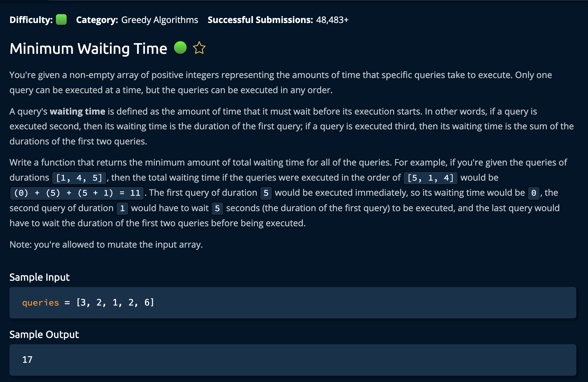

# MinimumWaitingTime

## Description



## Solution

**Time: O(nlogn) Sorting** <br/>
**Space: O(1)** <br/>

1. Sort the list because the `bigger` the number is the more times it is added to `minimumWaitingTime`

```py
queries.sort() # queries = [1, 2, 3, 4, 5]
```

2. Iterate through list. At each location calculate the quiries that are left that need to wait. `len(queries) - (idx + 1)` this is then nultiplied by that current queries `duration`. This results in its total contrubution to the minimal waiting time.

```py
    for idx, duration in enumerate(queries):
        queriesLeft = len(queries) - (idx + 1)
        minimumWaitingTime += duration * queriesLeft
```

If it is at `index 1`, then there are 3 more instances where it will be added so its: **2 \* 3 = `6`**.
That value is then added to the `minimumWaitingTime` variable.<br/>

### Note:

Keep in mind that the last value's `duration` does not need to be multiplied by the `queriesLeft` and added to `minimumWaitingTime` because it is the last query that is left to be completed. However, it is still calculated in the loop because `queriesLeft = 0` and anything multiplied by 0 is 0.

if we added an if statement:

```py
    for idx, duration in enumerate(queries):
        if idx == len(queries) - 1:
            pass  # Do nothing
        else:
            queriesLeft = len(queries) - (idx + 1)
            minimumWaitingTime += duration * queriesLeft
```

It would result in the same `minimumWaitingTime`
