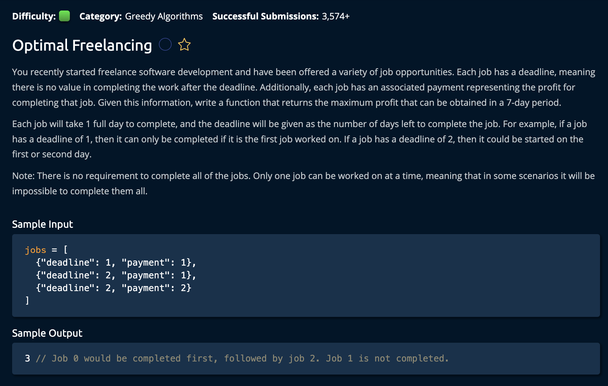

# OptimalFreelancing

## Description



## Solution

**Time: O(nlogn) Sorting** <br/>
**Space: O(1)** <br/>

1. Sort the list of `dictionaries` according to the payment field of each dictionary in the list

```py
jobs.sort(key=lambda job: job["payment"], reverse=True)

# Data structure
jobs = [
    {"deadline": 1, "payment": 1},
    {"deadline": 2, "payment": 1},
    {"deadline": 2, "payment": 2}
]
```

Keep in mind each index of the list is a `dictionary`. So, it is an `array` of dictionaries.<br>

2. Create an boolean array of 7(days fo the week) to keep track of the taken and avalibale days. `timeline = [False] * DaysOfTheWeek`

3. Iterate through the jobs. At each item in the list, find the max time that can be allocated for this job. This is either the "Job deadline" or "Last Day of the week".

```py
maxTime = min(job["deadline"], DaysOfTheWeek)
# We use min because if the deadline is in 20 days, we still only have 7 days to complete
```

4. Then, at each index of the list, we iterate through `timeline` in reverse order to find the farthest day that we can allocate this job to. We then add that jobs payment to the profit variable and break out of the loop.

```py
for time in reversed(range(maxTime)):
            if timeline[time] == False:
                timeline[time] = True
                profit += job["payment"]
                break
#Ensure we break so that for loop does not continue marking earlier days as True after finding a spot
```

Finally, we return `profit`
