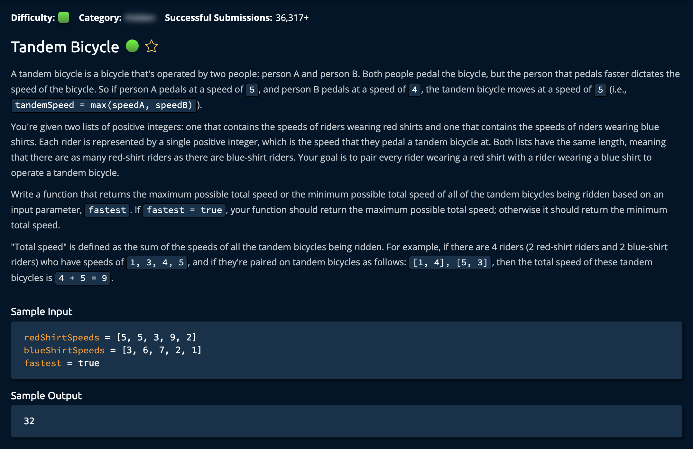

# TandedBicycle

## Description



## Solution 1

**Time: O(nlogn) Sorting** <br/>
**Space: O(1)** <br/>

1. Sort The two arrays Based on Fastest or Slowest Time

```py
# Second Array Sorted in Reverse for Max Speed
redShirtSpeeds.sort()
blueShirtSpeeds.sort(reverse=True)
```

This is because the `redShirtSpeeds[0]` has the largest and `blueShirtSpeeds[0]` has the smallest. As you go farther down iterating through the arrays, `blue` gets bigger and `red` gets smaller. This results in the largest possible total speed.<br>

```py
# Both arrays sorted in descending order for Min Speed
redShirtSpeeds.sort()
blueShirtSpeeds.sort()
```

This is because both `redShirtSpeeds[0]` and `blueShirtSpeeds[0]` have the largest rider. As you go farther down iterating through the arrays, both `blue` and `red` get smaller. This results in the slowert possible total speed.

2. At each index, add the max speed between the two riders to the total speed.
