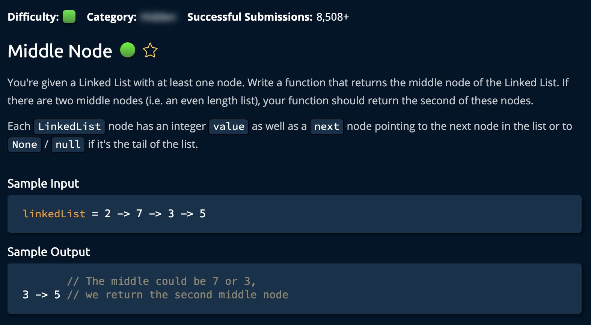

# MiddleNode

## Description



## Solution

**Time: O(n) Iterating Through List** <br/>
**Space: O(1)** <br/>

1. Create two pointers, **fast** and **slow**. These will be used to find the middle node.

```py
slow = linkedList
fast = linkedList
```

2. At each step, check if `fast.next` is None, if it isn't we start moving both nodes, one twice as fast as the other <br>

```py
while fast.next is not None:
    slow = slow.next
    fast = fast.next.next
    if fast == None: #This handles the case where fast is the last node in the list
        return slow
```

We check if fast.next is none because we need to garuntee that fast.next.next is either another node or None. <br>
Then we return the `slow` node which will be at the middle of the **LinkedList**

### Note

Keep in mind the `fast == None` check in the while loop is essential. In the case where fast is the secont to last: <br/>

```py
# linkedList = 1 -> 1 -> 3 -> 4 -> fast -> 2 -> None
```

If we do not jave this check then when the while loop does its check `fast.next` it generates an error. None.next does not exist!
