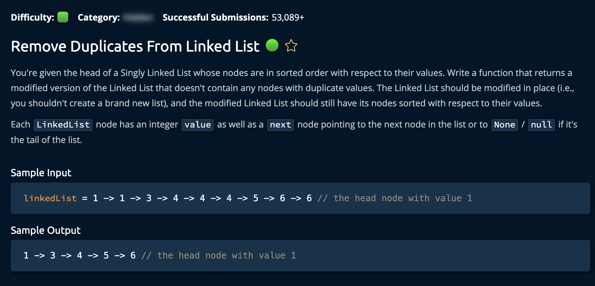

# RemoveDuplicatesLL

## Description



## Solution 1

**Time: O(n) Iterating Through List** <br/>
**Space: O(1)** <br/>

1. Iterate though the linked-list, tracking if the following node is `None` or another `Node`

```py
# if current.next is None: current is the last node in the list
while current.next is not None:
    ...
    current = current.next
```

2. At each step, check if the **current** nodes value is the same as the **following node's** value. If it is, then set the current nodes next property to the following nodes next property.<br>

```py
if current.value == current.next.value:
            current.next = current.next.next
# linkedList = 1 -> current -> current.next -> current.next.next -> 6 -> None
```

`current.next = current.next.next` effectively removes its **following node** from the Linked List.

### Note

Keep in mind that the `current.next.next` property of the will be `None` when the while loop approaches the end of the list. <br/>

To put it plainly, the **while loop** will stop at the second to last node in the list because of the check `while current.next is not None:`. Hence, at the last step `current.next.next` will be `None`

```py
# linkedList = 1 -> 1 -> 3 -> 4 -> current -> current.next -> None
```
