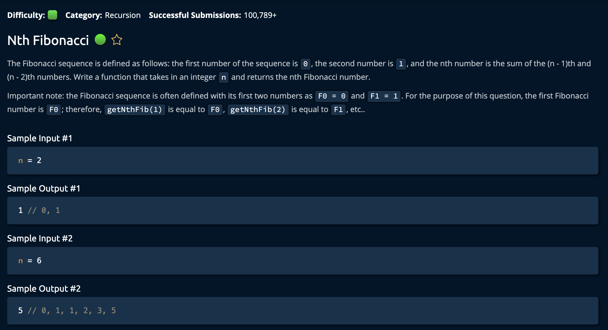

# NthFibonacci

## Description



## Solution 1

```py
def getNthFib(n):
    if n == 1:
        return 0
    elif n == 2:
        return 1
    else:
        return getNthFib(n-1) + getNthFib(n-2)
```

**Time: O(2^n) Two Recursive Calls Per Call Stack Layer** <br/>
**Space: O(n) Variables** <br/>

1. Take care of the base case for the first two Fib Numbers `F(1) = 0` & `F(2) = 1`. This is essential for recursion because it tells the function when to stop calling itself and start returning values back up the chain.

```py
if n == 1:
    return 0
elif n == 2:
    return 1
```

2. If the fib number(n) is any larger than 2, then we perform the calculation of `F(n-1)` + `F(n-2)`.<br>

```py
return getNthFib(n-1) + getNthFib(n-2)
```

This return function builds the Fibonacci sequence by calling the same function to get the previous two Fibonacci numbers. It returns the `sum` because the **value** of sum accumilates as **function calls** accumilate on the call stack. Each recursive call will end when the base case is reached and retrun the value(sum) back up the call chain. <br>

Keep in mind that at each step, `n` is being reduced by 1 and 2. Therefore `n` will eventually reach the base case of **n = 1** and **n = 2**. <br>

## Solution 2 (Optimal)

```py
def getNthFib(n):
    # Base Case Values
    a = 0
    b = 1
    for _ in range(n-1):
        temp = a
        a = b
        b += temp
    return a
```

**Time: O(n)** <br/>
**Space: O(1)** <br/>

1. Create variables `a` and `b`. These will represent the `current(a)` Fibonacci number and the `next(b)`. `a` and `b` are initialized to the first 0 and 1 respectively according to the predefined Fibonnaci base cases.

```py
a = 0
b = 1
```

2.  Create a for loop that executes n-1 times.

```py
for _ in range(n-1):
    temp = a # Saved so to be added it b resulting in F(n + 1)
    a = b # Current fib number assigned to a
    b += temp # Next fib number calculated
return a
```

Essentially, what's happening is that we are shifting the values to the left by one index. `LastTwoFibNumbers[a, b]` and afterwards, adding the value of `a` to `b`. We _add_ `a` to `b` to calculate the next Fib number for the next for loop cycle: `F(n-1)` + `F(n-2)`<br>

_Note: we may or may not use that value in `b` depending on if we are at the end of the `for loop`._ <br>

The next step is to return the value of `a`. This is the current Fibonacci number. <br>

We run the loop `n-1` times because the loop is "one step ahead of the current fib" as `b` is calculated when the current fib number is assigned to `a`.
