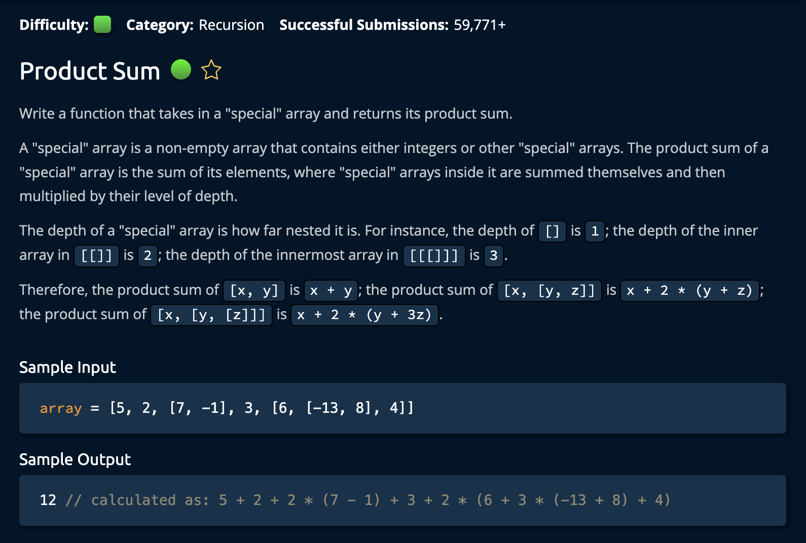

# ProductSum

## Description



## Solution

```py
def productSum(array, depth=1):
    sum = 0
    for value in array:
        if type(value) is list:
            sum += productSum(value, depth + 1)
        else:
            sum += value
    return sum * depth
# array = [5, 2, [7, -1], 3, [6, [-13, 8,] 4]]
# len(array) = 5, maxDepth = 3
```

**Time: O(n) - Every Element In Array** <br/>
**Space: O(d) - Greatest depth of the Sub-Arrays** <br/>

1. Initialize `sum`. This variable will be accumilated in the _for loop_ on the **array** and the _recursive calls_ on the **sub-arrays**.

2. Iterate through array and check if each `value` is a list or not.

```py
if type(value) is list:
    sum += productSum(value, depth + 1)
```

3. If the `value` is a list then we call the recursive function.

```py
sum += productSum(value, depth + 1)
```

Note that 1 is added to the depth each time the algorithm finds a nested list. So a list inside of a list would have a depth of `3`. Each value on the surface level of the array has a depth of `1`. <br>

4. If the `value` is a number we simply add it to the sum.

```py
else:
    sum += value
```

Finally, we `return sum * depth`.<br>

## Note

Why do we return `sum * depth`?

```py
array = [5, 2, [7, -1], 3, [6, [-13, 8,] 4]] # len(array) = 5, depth = 3
```

Index 2 is where the recursive call `sum += productSum(value, depth + 1)` is made on the nested list [7, -1]. At this point, sum = 5 + 2 = 7 and depth = 1. <br>

After the recursive call on [7, -1] is complete, it needs to be multiplied by its depth. In other words, the sum of [7, -1] which is 6, gets multiplied by its `depth` of 2 before being added to the main sum.
