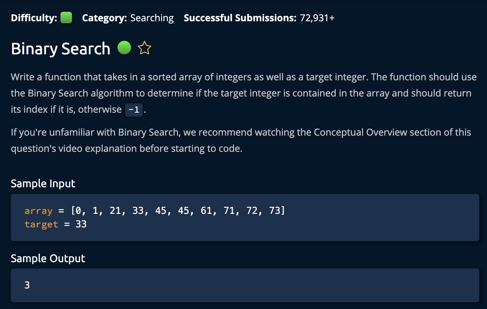

# BinarySearch

## Description



## Solution

```py
def binarySearch(array, target):
    left = 0
    right = len(array) - 1
    while left <= right:
        middle = (left + right) // 2
        if array[middle] == target:
            return middle
        elif array[middle] < target:
            left = middle + 1
        elif array[middle] > target:
            right = middle - 1
    return -1
```

**Time: O(logn) Two Recursive Calls Per Call Stack Layer** <br/>
**Space: O(1) Variables** <br/>

1. Create two pointers `left` and `right` that point to the first and last index of the array.

2. Create a `while` loop that will run as long as `left < right`.

3. At each step, calculate the middle of the array: `middle = (left + right) // 2`. The Operator "//" removes any remainder insureing the result is an **integer**.

```py
if array[middle] == target:
    return middle
elif array[middle] < target:
    left = middle + 1
elif array[middle] > target:
    right = middle - 1
```

If the `middle` is equal to the `target`, return the **index**. If the `middle` is less than the `target`, move the left pointer to the **middle + 1**. We add 1 to because we already checked the value of middle. We also account for when left and right are beside each other. <br>

Finally we return -1 if the left and right pointers pass each other

```py
return -1
```

## Recursive Solution

```py
def binarySearch(array, target):
    return binarySearchHelper(array, target, 0, len(array) - 1)


def binarySearchHelper(array, target, left, right):
    if left > right:
        return -1

    middle = (left + right) // 2
    if target == array[middle]:
        return middle
    elif target > array[middle]:
        return binarySearchHelper(array, target, middle + 1, right)
    else:
        return binarySearchHelper(array, target, left, middle - 1)

```

**Time: O(logn)** <br/>
**Space: O(logn)** <br/>

1. Create a helper function with arguments `array`, `target`, `left`, and `right`.

2. Create a base case with the same condition as the previous solution. `if left > right: return -1` <br>

The logic is the same as the previous solution. For each recursive call, we calculate the middle of the array and check if it's equal to the target. If it is, return the index. If it's less than the target, we call the helper function again with the same arguments but with `middle + 1` as the new `left` value. If it's greater than the target, we call the helper function again with the same arguments but with `middle - 1` as the new `right` value. <br>

and we're **done**.

## Colcusion

It would be good to explain to the interviewer ethat it can be done recursively- but to then go ahead with the iterative solution as it has a smaller space compelxity.
