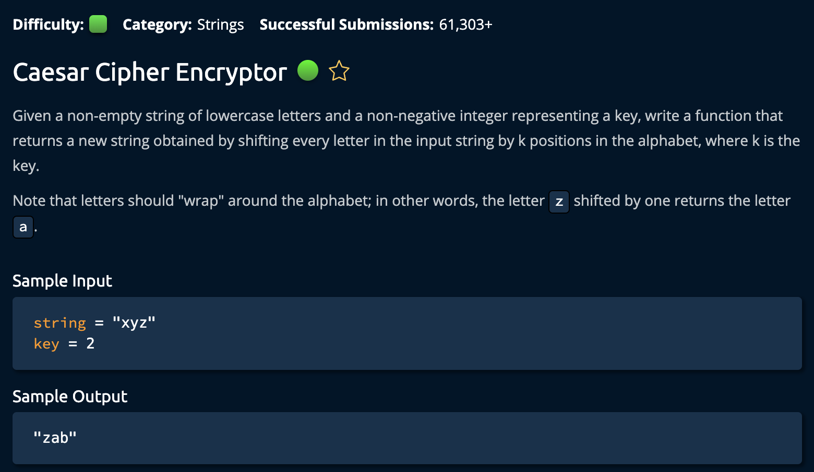

# CeasarCipherEncryptor

## Description



## Solution

```py
def caesarCipherEncryptor(string, key):
    shiftValue = key % 26
    newString = ""
    for char in string:
        unicodeValue = ord(char) + shiftValue
        if unicodeValue <= 122:
            newString += chr(unicodeValue)
        else:
            newString += chr(96 + unicodeValue % 122)
    return newString
```

## Explanation

**Time: O(n) For iterating through the string** <br/>
**Space: O(1)** <br/>

Firstly, there are a few concepts to cover before explaining the algorithm.

- What is the **ord()** and **chr()** function?
- What is `unicodeValue`?

Since computers cannot recognize letters like the human brain can, _Unicode_ is a system designed to assigns numbers to characters. This is why we can use the `ord()` function to get the `unicode number` from a character and the `chr()` function to get the character from a `unicode number`. <br>

For example, ord(97) = `a` and chr(122) = `z`.

1. Declare two variables, `newKey` and `newString`. `newKey` is the modulous of 26 to cover the edge case where the key is greater than 26(numebrs in teh alphabet). To put it simply, `a` shifted **26** letters over is still `a`. And a shifted **27** letters is `b`.

```py
newKey = key % 26
newString = ""
```

The plan is to iterate through the input string, convert the string into unicode, shift its value over(according to the key) then convert it back to a string.<br>

```py
for char in string:
        unicodeValue = ord(char) + shiftValue
        if unicodeValue <= 122:
            newString += chr(unicodeValue)
        else:
            newString += chr(96 + unicodeValue % 122)
```

We convert the current string into its Unicode value, add the `shiftValue`, and place it in the variable `unicodeValue`. We then check if that value is greater than 122(which is z) if it is, then we need to wrap around to right before the begining of the alphabet(which is **96**). Remember ord(a) = 97. <br>

For example, if the `unicodeValue` is **124**, then we know that the `shiftValue` is really **2**(124 % 122). Hence we add `chr(96 + unicodeValue % 122)` if `unicodeValue` > **122**.<br>

Finally, after iterating through the entire input string we return `newString` . <br>

```py
return newString
```

And we're **Done**!
