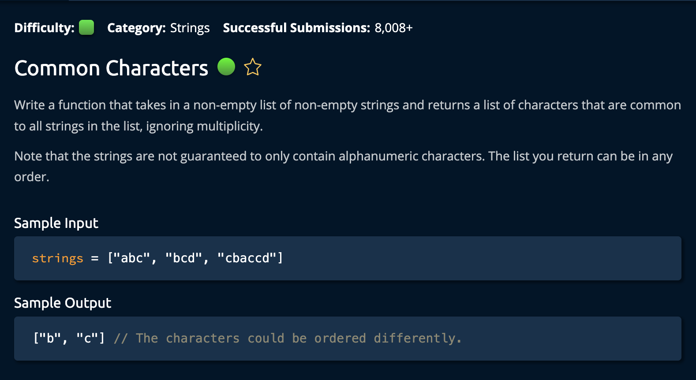

# CommonCharacters

## Description



## Solution

```py
def runLengthEncoding(string):
    result = []
    count = 1

    for idx in range( len(string) - 1):
        if string[idx] == string[idx + 1] and count < 9:
            count += 1
        else:
            result.append(str(count))
            result.append(string[idx])
            count = 1

    result.append(str(count))
    result.append(string[-1])

    return "".join(result)
```

## Explanation

**Time: O(n) For `iterating` through the input string and converting a `List` to a `String`** <br/>
**Space: O(n)** <br/>

1. Create two variables, an empty string called `result` for returning the encoded string, and an integer `count` for keeping track of the amount of times a character appears consecutively.

```py
result = []
count = 1
```

The plan is to iterate through the input string. At each point, if the current character is equal to the following character: we add 1 to the variable `count`. If `count` is greater than **9** we have to add it to the encoded string(we can't add a result of 10A, it has to be representd as 9A1A)<br>

```py
for idx in range(len(string) - 1):
        if string[idx] == string[idx + 1] and count < 9:
            count += 1
        else:
            result.append(str(count))
            result.append(string[idx])
            count = 1
```

We use the range `len(string) - 1` because we are checking the strings `string[idx] == string[idx + 1]`. If we enable the loop to go all the way to the last index, then "string[idx + 1]" would not exist.<br>

After the for loop we append the count for the last string in the array, this is because the loop stops at `len(string) - 1` <br>

```py
result.append(str(count))
result.append(string[-1])
```

Finally we convert the result to a string and return it. this is done using the .join() method in Python. It joins the elements of a list with an optinal criterial to separate the elements. It coule be a `,`,`.`, `number` or even a `" "`. In our case we have no criteara so it effectively converts it to a string. <br>

```py
return "".join(result) # O(n)
```

And we're **Done**!
