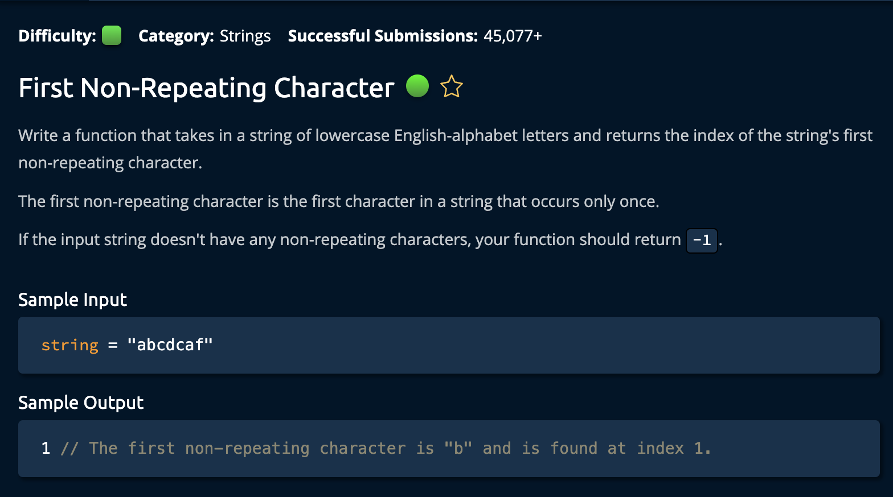

# First Non-Repeating Character

## Description



## Solution

```py
def firstNonRepeatingCharacter(string):
    occurences = {}
    for char in string:
        if char not in occurences:
            occurences[char] = 1
        else:
            occurences[char] += 1

    for idx, char in enumerate(string):
        if occurences[char] == 1:
            return idx

    return -1
```

## Explanation

**Time: O(n) For _iterating_ through the input string twice** <br/>
**Space: O(1) Because the max number of strings in the dictionary is 26**<br/>

The plan is to iterate through the input string and count the number of times each character appears. Then, we iterate through the string a second time to check for the first character that has a count of 1. If we find one, we return its index. If we don't find one, we return -1.

1. Create a dictionary, `occurences`, to store the number of character occurences for each character in the input string.

```py
occurences = {}
```

2. Iterate through the input string and check if each char is in the dictionary. If it's not, initialize its value to 1, if it is, increment it by one.

```py
for char in string:
    if char not in occurences:
        occurences[char] = 1
    else:
        occurences[char] += 1
```

3. Then iterate through the string a second time, checking if the count of the character is 1. If it is, return the index because that char is **non-repeating**

```py
for idx, char in enumerate(string):
    if occurences[char] == 1:
        return idx

return -1
```

And we're **Done**!
