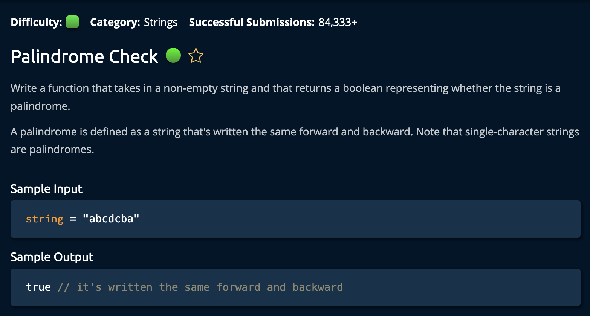

# PalindromeCheck

## Description



## Solution

```py
def isPalindrome(string):
    left = 0
    right = len(string) - 1

    while left <= right:
        if string[left] == string[right]:
            left += 1
            right -= 1
        else:
            return False
    return True
```

## Explanation

**Time: O(n) For iterating through the array** <br/>
**Space: O(1)** <br/>

1. Create two pointers, `left` and `right` that point to the first and last value in the input string

```py
left = 0
right = len(string) - 1
```

The plan is to create a loop that checks if `left` and `right` are equal. If this is true, then `left` and `right` are moved closer to the _middle_ of the string(by one index at a time).<br>

Keep in mind that if the number is **even**, `left` and `right` will point to the same number at the end. If it is **odd** then they will point to the two center numbers. See two examples below:

```py
# Middle numbers are capitalized
oddNumberString = "abcDcba"
evenNumberString = "abCCba"
```

In the condition of the `while loop` it checks if the `left` and `right` pointers have "crossed paths" as yet: meaning the `left` index is smaller or equal to the `right` index. If not, it contonues excecuting the algorithm. <br>

If at any point the left and right pointers are not equal, we _immediately_ return False and end the function because it is garuneteed that string is not a `palindrome`(See definition of a palindrome in problem description). <br>

```py
while left <= right:
        if string[left] == string[right]:
            left += 1
            right -= 1
        else:
            return False
return True
```

If we reach the condition where the while loop has traversed the entire input string without returning `False`, then we know it is a palindrome and return `True`. <br>

And we're **Done**!
