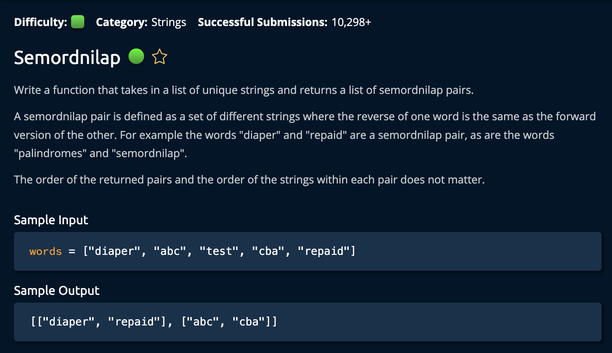

# Min-Heap Construction

## Description



## Solution

```py
def semordnilap(words):
    wordsSet = set(words)
    pairs = []

    for word in words:
        reverse = word[::-1]
        if reverse in wordsSet and reverse != word:
            pairs.append([word, reverse])
            wordsSet.remove(word)
            wordsSet.remove(reverse)

    return pairs

```

## Explanation

**Time: O(n \* m) "n" is for the size of the set, "m" is for the largest string** <br/>
**Space: O(n \* m) "n" is for the size of the set, "m" is for the largest string**<br/>

The plan is create a set(`wordsSet`) from the input `words` array. Next, we iterate through `words`: at each element, we check if the reversed version of that word is also in the set(`wordsSet`). If it is, we add that pair to the result array `pairs` and remove those two words from the set. <br>

(we remove it so that we dont end up adding it to the array a second time when the loop reaches the second element pf the pair)

1. Create set(`wordsSet`) from the input array using the set() function in Python. Also create a list called `pairs`: this will be a 2D array

```py
    wordsSet = set(words)
    pairs = []
```

2. Iterate through the input array: at each item, check if the reversed version of that word is also in the set(`wordsSet`). If it is, we add that pair to the result array `pairs` and remove those two words from the set.

```py
    for word in words:
        reverse = word[::-1]
        if reverse in wordsSet and reverse != word:
            pairs.append([word, reverse])
            wordsSet.remove(word)
            wordsSet.remove(reverse)
```

### Note:

We need to check if the reversed version of the word is not the same as the original word:

```
..and reverse != word
```

This is a word being hte same as it's reversal is a _palindrome_, not a **semordnilap**. Also, `word[::-1]` is a utilization of the python slicing function and essentially reverses the string. It is a O(n) time operation.

Finally, we reutn the 2D pairs array:

```py
return pairs
```

And we're **Done**!
