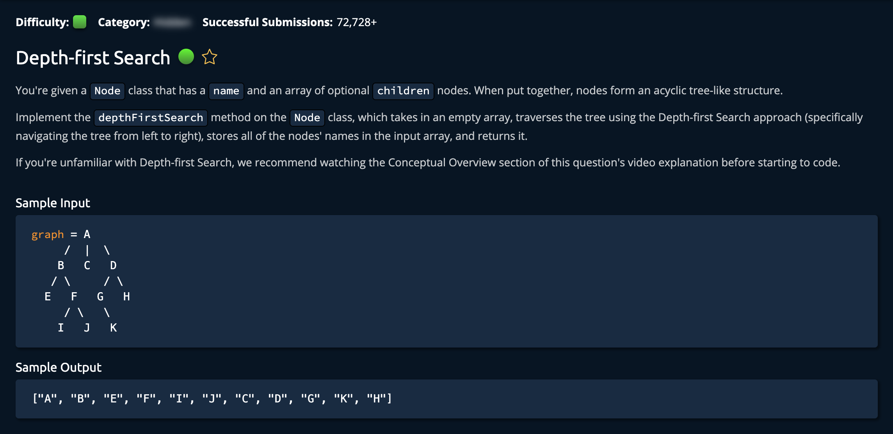

# DepthFirstSearch

## Description



## Solution 1

**Time: O(v + e)** <br/>
**Space: O(v) Array has every vertex in the tree + call stack = 2v** <br/>

1. Append the currently visited node's letter to Array:

```py
array.append(self.name)
```

The algorithm then iterates through every child on that currently visited node. `"for child in self.children:"` On each child node, it calls the same DFS algorithm on that node. This results in a recursive call on a nodes `child`, then the `grandchild`, then the `greatgrandchild` and so on.<br>

This results in a DFS. Also, keep in mind that the base case is:

```py
for child in self.children:
```

if the child node has no children the the for loop is not excecuted.

### Note

```py
# These methods were given
def __init__(self, name):
        self.children = []
        self.name = name

def addChild(self, name):
        self.children.append(Node(name))
        return self
```
