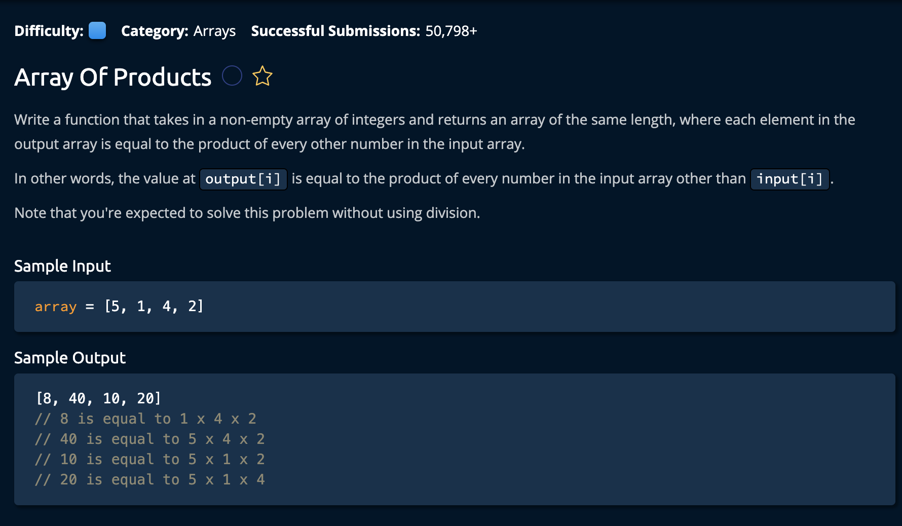

# Array Of Products

## Description



## Solution

```py
def arrayOfProducts(array):
    newArray = [1 for _ in range(len(array))]
    
    accumilatedProduct = 1
    for i in range(len(array)):
        newArray[i] = accumilatedProduct
        accumilatedProduct *= array[i]

    accumilatedProduct = 1
    for i in reversed(range(len(array))):
        newArray[i] *= accumilatedProduct
        accumilatedProduct *= array[i]
        
    return newArray
```

**Time Complexity:** O(n) `n` for iterating through every element the array(twice)<br/>
**Space Complexity:** O(n) for storing `newArray`<br/>

1. First, we need to create an array with the same size as the input array:<br>

```py
newArray = [1 for _ in range(len(array))]
```

Then, at each index, we determine what is the total accumilated product of all the numbers to its **left**, then determine the accumilated product of all the numbers to its **right**.<br>

Why do we separate it into two steps? To prevent duplicate calculations in the for loops.

2. The `accumilatedProduct`(left): At each step, we assign the accumilatedProduct to the index and caclulate the accumilatedProduct for the next index

```py
accumilatedProduct = 1
for i in range(len(array)): 
    newArray[i] = accumilatedProduct # assign to index
    accumilatedProduct *= array[i] # calculate accumilatedProduct for next index
```

note: the accumilatedProduct for the first index is 1.

3. The `accumilatedProduct`(right): The same process goes for the "right implementation" but the for loop goes in reverse order. 

```py
accumilatedProduct = 1
for i in reversed(range(len(array))):
    newArray[i] = accumilatedProduct # assign to index
    accumilatedProduct *= array[i] # calculate accumilatedProduct for next index
```

### Why this works:

If the sum of the products on the left is 14(7 * 2) and the sum of the products on the right is 10(2 * 5), multiplying 14 * 10 is the same as multiplying  2 * 5 * 7 * 2.

Finally we return the new array.

```py
return newArray
```

and we're **Done!**
