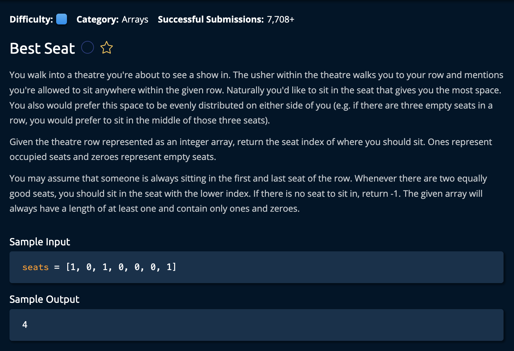

# Best Seat 

## Description



## Solution

```py
def bestSeat(seats):
    longest_empty_space = 0
    best_seat_idx = -1
    empty_space = 0
    for i in range(len(seats)):
        if not seats[i]:
            # Found empty seat, add to current count and continue
            empty_space += 1
        else:
            # Found a taken seat, determine if seen space
            # is better than anything previously found
            if empty_space > longest_empty_space:
                longest_empty_space = empty_space
                best_seat_idx = i - 1 - empty_space // 2
            empty_space = 0
    return best_seat_idx
# Credit: Carlos on January 5, 2024
```

**Time Complexity:** O(n) For iterating the input array<br/>
**Space Complexity:** O(1)<br/>

### The Approach:

The idea is to iterate through the array and check the amount of succesive Zeros in the array(which represent the space around the seats). If the space is largest then we select the seat in the middle of the space.

1. First we create variables to hold the longest recorded space(`longest_empty_space`), the loaction of the best seat(`best_seat_idx`), and the amount of space recorded at each seat(`empty_space`). <br>

```py
longest_empty_space = 0
best_seat_idx = -1
empty_space = 0
```

2. Next, we iterate through the array. At each point we increment the space counter if that current index is ZERO(if not seats[i]). That if statement returns FALSE if **i = 0** and TRUE if **i = 1**.<br>

```py
if not seats[i]:
    # Found empty seat, add to current count and continue
    empty_space += 1
else:
```

3. If the current seat is a 1, we check the incremented space variable(`empty_space`) to see if it the new value is larger. If it is we calculate the new bestSeat as the seat in the middle of that new space.

```py
else:
    # Found a taken seat, determine if seen space
    # is better than anything previously found
    if empty_space > longest_empty_space:
        longest_empty_space = empty_space
        best_seat_idx = i - 1 - empty_space // 2
    empty_space = 0
```
4. Finally we return the `best_seat_idx`

```py
return best_seat_idx
```

and we're **done**!
