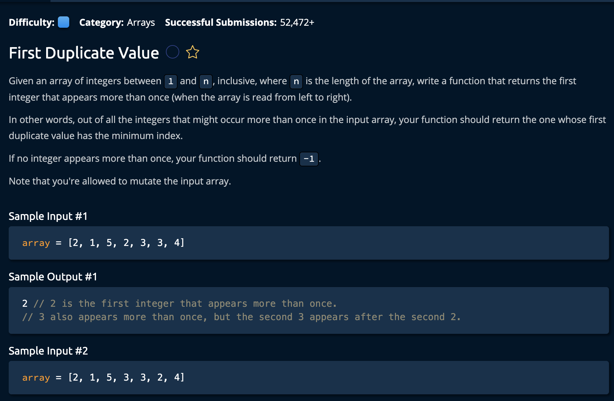

# First Duplicate Value

## Description



## Solution

```py
def firstDuplicateValue(array):
    
    for num in array:
        absolutevalue = abs(num) 
        if array[absolutevalue - 1] < 0:
            return absolutevalue
        else:
            array[absolutevalue - 1] *= - 1
            
    return -1
```

**Time Complexity:** O(n) `n` for iterating through every element the array<br/>
**Space Complexity:** O(1)<br/>

### Approaching The Solution

The idea is to iterate through the array from right to left. At each point- we check if the the current nunumber has been viewed already indicated by a negative sign.<br>

We can do this because we know that the integers are between 0 and `n`. So the only way there are no duplicates is if every number between 0 and n are used exaxtly **once**. 

```py
#  0  1  2  3
# [1, 2, 3, 4] <- 5 is not allowed
```

We can accomplish this by doing the following
1. Find the absolute value of the current number
```py
absolutevalue = abs(num) 
```
2. Find the corresponding index for that number(nmber 4 is index 3)
3. If index has been visited already return that number
```py
if array[absolutevalue - 1] < 0:
    return absolutevalue
else:
    array[absolutevalue - 1] *= - 1
```
4. If we have reached the end of the array without finding a duplicate return -1
```py
return -1
```

and we're **Done!**
