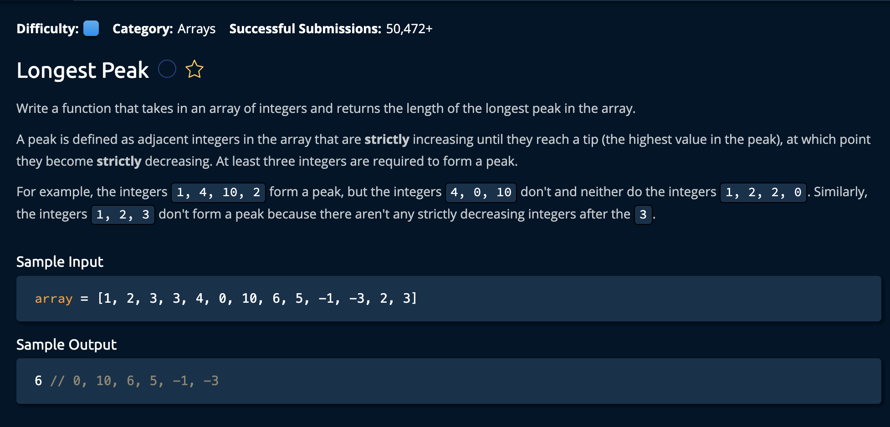

# Longest Peak

## Description



## Solution

```py
def longestPeak(array):
    logestPeakLength = 0
    i = 1
    while i < len(array) - 1:
        isPeak = array[i - 1] < array[i] and array[i] > array[i + 1]
        if not isPeak:
            i += 1
            continue

        leftIdx = i - 2
        while leftIdx >= 0 and array[leftIdx] < array[leftIdx + 1]:
            leftIdx -= 1
        rightIdx = i + 2
        while rightIdx < len(array) and array[rightIdx] < array[rightIdx - 1]:
            rightIdx += 1

        peakLength = rightIdx - leftIdx - 1
        logestPeakLength = max(logestPeakLength, peakLength)
        i = rightIdx

    return logestPeakLength


```

**Time Complexity:** O(n) `n` for iterating through every element the array<br/>
**Space Complexity:** O(1) for storing variable values<br/>

1. The idea is to iterate through the array from the `second` index to the `second to last` index and identify the peaks using the following formula:<br>

```py
isPeak = array[i - 1] < array[i] and array[i] > array[i + 1]
```

If the current index is a *peak*, we find its length by moving a `left` and `right` pointer out from the index, ensuring that both the left and right indexes are strictly **decreasing**.

```py
leftIdx = i - 2
while leftIdx >= 0 and array[leftIdx] < array[leftIdx + 1]: # ensures a strict decrease
    leftIdx -= 1 # moves pointer left by one for next while loop
rightIdx = i + 2
while rightIdx < len(array) and array[rightIdx] < array[rightIdx - 1]:# ensures a strict decrease
    rightIdx += 1 # moves pointer right by one for next while loop
```

2. The we calculate the length using the following formula: <br>

```py
peakLength = rightIdx - leftIdx - 1
```

Next, in the while loop condition `while i < len(array) - 1:`, we comapre if the current peak is larger than the value stored in the variable `logestPeakLength`(which is initialized to **0**). Then we move our current index to rightIdx for the next iterationof the outer while loop.

```py
    i = rightIdx
    #end of outer while loop
return logestPeakLength
```

and we're **done**!
