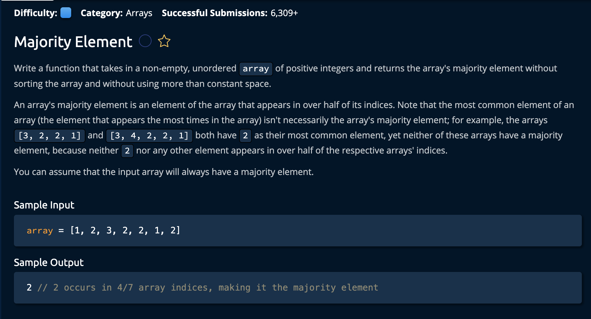

# Majority Element

## Description



## Solution

```py
def majorityElement(array):
    count = 0
    answer = None
    
    for num in array:
        if count == 0:
            answer = num

        if num == answer:
            count += 1
        else:
            count -= 1
            
    return answer
```

**Time Complexity:** O(n) `n` for iterating through every element the array<br/>
**Space Complexity:** O(1) for storing variable values<br/>

### The Approach

The idea is to iterate through the array. At each index we consider it as a "Sub-Array", determining weather or not it has a Majority Element, if it doesn't we move on to the next index and treat it as a new sub array. Now, how do we determine if there is a Majority Element?<br>


1. Create `count` and `answer` variables to keep track of recurring numbers and to hold the answer for the function to return. 
```py
count = 0 
answer = None
```


2. Then we iterate through the array, at each point we check if the current num is equal to the potential majority element, if it is we icnrement cout by one, if not we decrement cou tby one.

- if count becomes 0 there is no majority element
- if count is posituve thenwe have a potential majority element

note that once we reach the end of the array, we know that potential majority element is the majority element

```py
for num in array:
        if count == 0: # this is where we start are new "sub array"
            answer = num

        if num == answer:
            count += 1
        else:
            count -= 1
```

Note that `answer` = `num` if the count is euqal to 0. We do this because we know that the number of the "Potential Majority Element" is equal to the number of other elements. Essentially, its split in half so we can desregard that subarray. <br>

finally we can return the asnwer once we have reached the end of the array.

```py
 return answer
```

and we're **done**!
