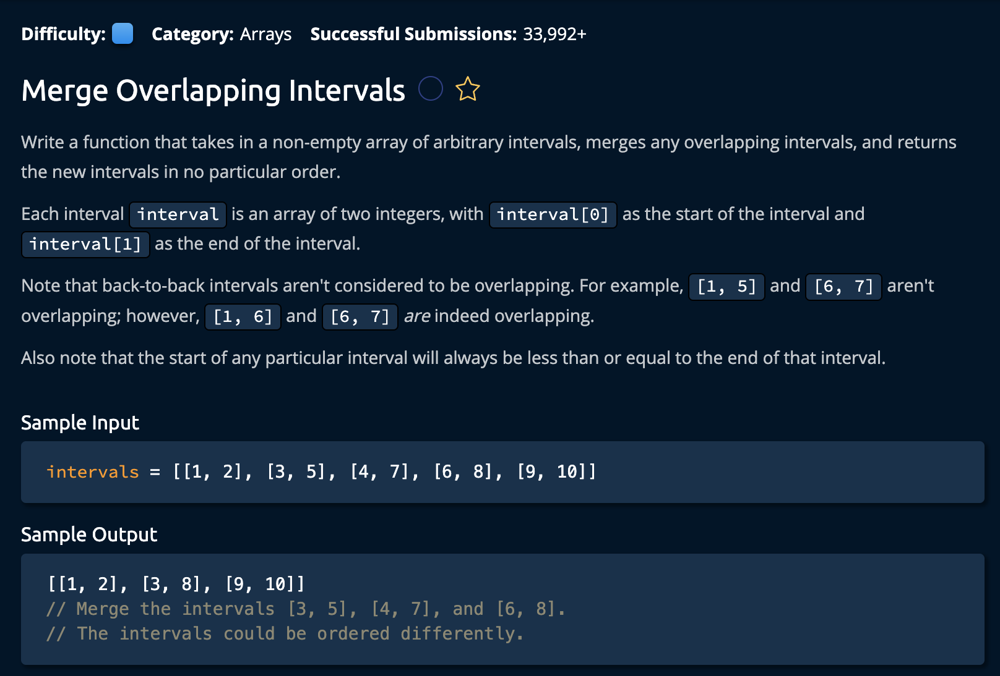

# Merge Overlapping Intervals

## Description



## Solution

```py
def mergeOverlappingIntervals(intervals):
    sortedIntervals = sorted(intervals, key = lambda x: x[0])
    mergedIntervals = []
    currentInterval = sortedIntervals[0]
    mergedIntervals.append(currentInterval)
    
    for nextInterval in sortedIntervals:
        _, currentIntervalEnd = currentInterval
        nextIntervalStart, nextIntervalEnd = interval

        if currentIntervalEnd >= nextIntervalStart:
            currentInterval[1] = max(currentIntervalEnd, nextIntervalEnd)
        else:
            currentInterval = nextInterval
            mergedIntervals.append(currentInterval)
        
    return mergedIntervals
```

**Time Complexity:** O(nlog(n)) For sorting the input array<br/>
**Space Complexity:** O(n) for creating a new `mergedIntervals` array<br/>

### The Approach:

The idea is to first create a sorted version of the input array(`intervals`) according to the first value of each interval. Meaning:

```py
# [5,6] [1,2] [3,4] becomes -> [1,2] [3,4] [5,6]
```
And then we will check if any of the intervals overlap each other. If the do we merge those intervale and place them in the `mergedIntervals` array. Here's how we accomplish this:

1. Create a new array sorted by the first value of each interval(`sortedIntervals`), a results array to return to the function caller(`mergedIntervals`), and a `currentInterval` variable to place the intervals in the result array.<br>

```py
sortedIntervals = sorted(intervals, key = lambda x: x[0])
mergedIntervals = []
currentInterval = sortedIntervals[0]
mergedIntervals.append(currentInterval) # we also initialize the first value to be the first value from the sorted intervals array
```

2.Then, we iterate through the sorted intervals and check if the intervals overlap. But first, we need to create some variables to compare:<br>

```py
# these is python's tuple syntax used ot select both indeces of a "2-valued array"
_, currentIntervalEnd = currentInterval 
nextIntervalStart, nextIntervalEnd = nextInterval
```
The unerline(_,) just means we are ignoring htat value. `nextIntervalStart` is equivalemnt to nextInterval[0] and `nextIntervalEnd` is equivalent to nextInterval[1].

Now we Iterate:

```py
if currentIntervalEnd >= nextIntervalStart:
            currentInterval[1] = max(currentIntervalEnd, nextIntervalEnd)
else:
    currentInterval = interval
    mergedIntervals.append(currentInterval)
```

If the intervals don't overlap we set the current interval to the `nextInterval` and append that to the merged intervals array.

3. at the end of the for loop we return the `megedIntervals`

```py
return mergedIntervals
```

and we're **done**!
