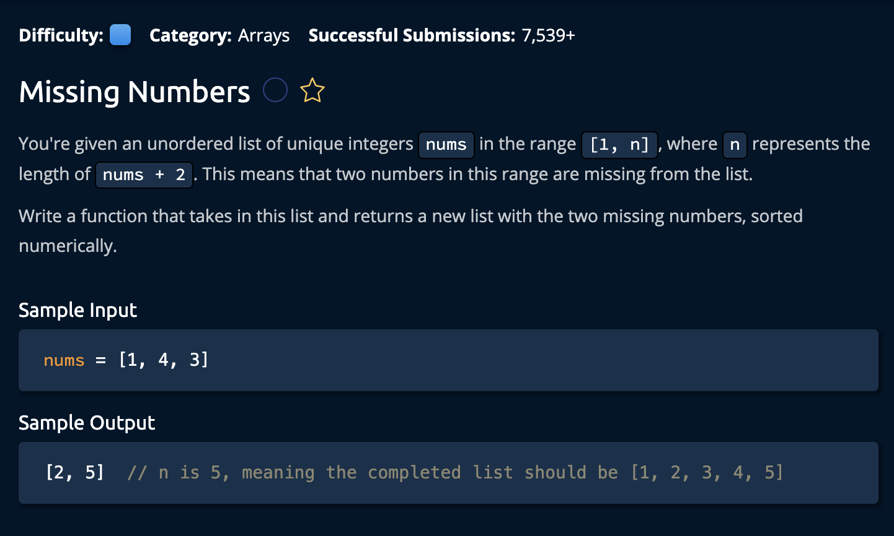

## Description



## Solution

```py
def missingNumbers(nums):
    total = sum(range(1, len(nums) + 3))
    for num in nums:
        total -= num

    averageMissingValue = total // 2
    foundFirstHalf = 0
    foundSecondHalf = 0

    for num in nums:
        if num <= averageMissingValue:
            foundFirstHalf += num
        else:
            foundSecondHalf += num

    expectedFirstHalf = sum(range(1, averageMissingValue + 1))
    expectedSecondHalf = sum(range(averageMissingValue + 1, len(nums) + 3))
        
    return [expectedFirstHalf - foundFirstHalf, expectedSecondHalf - foundSecondHalf]

```

**Time Complexity:** O(n) For iterating through the input array<br/>
**Space Complexity:** O(1)<br/>

### The Approach:

The idea is to use mathematical properties and the process of elimination to determine which numbers are missing. We know that two numbers are missing, therefore if we find the *difference* between the sum of our **given array** with the sum of the **expected array**, we are one step closer to finding which two numbers are missing.

1. Calculate the difference between the two arrays:

```py
total = sum(range(1, len(nums) + 3))
    for num in nums:
        total -= num
```

Now, we know that the average of the difference(the value of `total`) would be equal to the average of the missing numbers. We can use this average to find what we need. We can separate the array in two halfs, and compare their sums with the EXPECTED sums.<br>

1. Calculate the sum of first and second half. Which is determinded by the average missing value:<br>

```py
averageMissingValue = total // 2
foundFirstHalf = 0
foundSecondHalf = 0

for num in nums:
    if num <= averageMissingValue: # separates array into two
        foundFirstHalf += num
    else:
        foundSecondHalf += num
```

2. Now that we have are found values, we can compare them to the expected values(the case where no numbers are missing). We do this by utilizing hte range() function.<br>


```py
expectedFirstHalf = sum(range(1, averageMissingValue + 1))
expectedSecondHalf = sum(range(averageMissingValue + 1, len(nums) + 3))
```

Now that we found the expected values, we subtract and return the missing numbers.

```py
 return [expectedFirstHalf - foundFirstHalf, expectedSecondHalf - foundSecondHalf]
```

and we're **done**!
