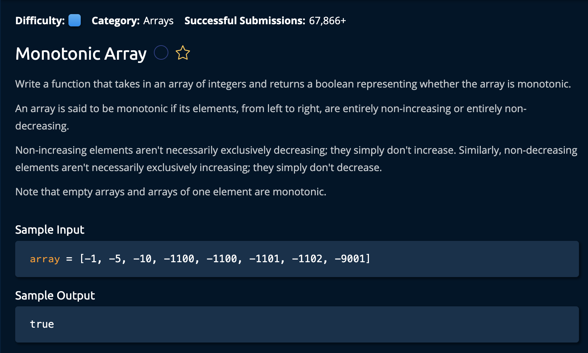

# MonotonicArray

## Description



## Solution

```py
def moveElementToEnd(array, toMove):
    first = 0
    last = len(array) - 1

    while first < last:
        while first < last and array[last] == toMove:
            last -= 1
        if array[first] == toMove:
            array[first], array[last] = array[last], array[first]
        first += 1
    return array
```

**Time Complexity:** O(n) `n` for iterating through the array with `first` and `last`<br/>
**Space Complexity:** O(1) because the array is sorted in place<br/>

1. The idea is two iterate through the array using two pointers `first` and `last`. At each loop, we make sure `last` is pointing at the leftfost integer that is equal to the `toMove` variable.<br>

```py
def moveElementToEnd(array, toMove):
    first = 0
    last = len(array) - 1

    while first < last:
        while first < last and array[last] == toMove:
            last -= 1
```
We also check if "first < last" in the nested while loop to cover an edge case where the array is sorted without checking all the indices.

```py
while first < last:
    while first < last and array[last] == toMove:
        last -= 1
    if array[first] == toMove:
        array[first], array[last] = array[last], array[first]
    first += 1
return array
```

2. Then, we check if the `first` index is equal to the value that we want to shift to the end of the array(`toMove`). If so, we swap it with the `last` index. We increment first by 1 because we know its value is in the correct position.

After indexes `first` and `last` cross each other we can exit the loop and return the sorted array. <br>

and we're **Done**!
