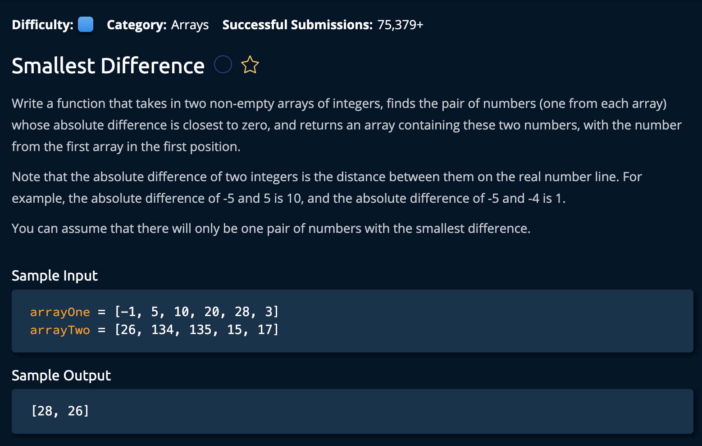

# Smallest Difference

## Description



## Solution

```py
def smallestDifference(arrayOne, arrayTwo):
    result = []
    smallestDifference = float('inf')
    currentDifference = float('inf')
    arrayOne.sort()
    arrayTwo.sort()
    p1 = 0
    p2 = 0

    while p1 < len(arrayOne) and p2 < len(arrayTwo):
        firstNum, secondNum = arrayOne[p1], arrayTwo[p2]
        if firstNum == secondNum:
            return [firstNum, secondNum]
        if firstNum < secondNum:
            currentDifference = secondNum - firstNum
            p1 += 1
        elif arrayOne[p1] > arrayTwo[p2]:
            currentDifference = firstNum - secondNum
            p2 += 1
        if currentDifference < smallestDifference:
            smallestDifference = currentDifference
            result = [firstNum, secondNum]

    return result
```

**Time Complexity:** O(nlogn) + (mlogm) `n` and `m` for the sizes of the two arrays and **sorting** them<br/>
**Space Complexity:** O(1)<br/>

The idea is to iterate through the input arrays and find the smallest difference between two elements. This is done more effeciently by sorting both arrays and using the _Two-Pointer Technique_. This means we will have `p1` and `p2` pointing to the first index of each array, then we will compare their differnece and move the pointers accordingly. At each point will try to get as close to **0** as possible <br>

If there is no difference between the two elements, we return the two elements.

1. First, we initialize our function return value as an empty list called `result`. Then we sort out input array. (This is done to implement a common left and right pointer technique)

```py
result = []
array.sort()  # nlogn time
```

#### How The Two-Pointer Technique Works:

The _Two-Pointer Technique_ is commonly used in problems involving sorted arrays to find a set of elements that meet certain criteria. For our case: summing up to a target value.

2. Now, We iterate through the input array, setting the `left` pointer to one index ahead of the currently observed value `i`. The `right` pointer is set to the last index of the array.
