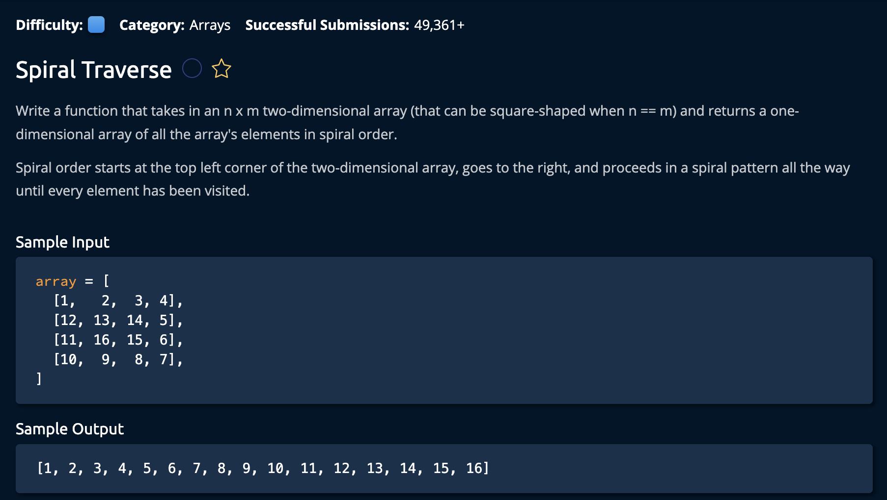

# Spiral Traverse

## Description



## Solution

```py
def spiralTraverse(array):
    result = []
    startRow, endRow = 0, len(array) - 1
    startCol, endCol = 0, len(array[0]) - 1

    while startRow <= endRow and startCol <= endCol:
        for col in range(startCol, endCol + 1): 
            result.append(array[startRow][col])
            
        for row in range(startRow + 1, endRow + 1):
            result.append(array[row][endCol])
            
        if startRow < endRow:
            for col in reversed(range(startCol, endCol)):
                result.append(array[endRow][col])
        if startCol < endCol: 
            for row in reversed(range(startRow + 1, endRow)):
                 result.append(array[row][startCol])
            
        startRow += 1
        endRow -= 1
        startCol += 1
        endCol -= 1
        
    return result
```

**Time Complexity:** O(n) `n` for iterating through every element the 2D array<br/>
**Space Complexity:** O(n) for returning an array with the elements in spiraled order<br/>

1. The idea is to create an algorithm that iterates throughout the "perimeter" of the matrix. Even if its 2x2. So first we identity the start and end rows, along side the start and end columns.<br>

```py
startRow, endRow = 0, len(array) - 1
startCol, endCol = 0, len(array[0]) - 1
```
Iterating through the perimeter must be terminated by some condition. If the startRow/startCol is greater than the endRow/endCol, than we end the loop. 

```py
while startRow <= endRow and startCol <= endCol:
```

2. Now, we create the 4 for loops to iterate through the perimiter of the matrix. <br>

### Left to Right
```py
for col in range(startCol, endCol + 1): 
    result.append(array[startRow][col])
```
This loop moves from left to right including the last element.

### Top to Bottom
```py
for row in range(startRow + 1, endRow + 1):
    result.append(array[row][endCol])
```
This loop moves from top to bottom skipping the top right element and including the bottom element.

### right to Left
```py
if startRow < endRow:
    for col in reversed(range(startCol, endCol)):
        result.append(array[endRow][col])
```
This loop moves from right to left excluding the bottom right(Remember, this is a reversed loop).

### Bottom to top
```py
if startCol < endCol: 
    for row in reversed(range(startRow + 1, endRow)):
            result.append(array[row][startCol])
```
This loop moves from bottom to top excluding the bottom left and top right(Remember, this is a reversed loop). In `range(startRow + 1, endRow)`, 
This loop moves from bottom to top excluding the bottom left and top right(Remember, this is a reversed loop). In `range(startRow + 1, endRow)`, `endRow` is excluded. and `startRow + 1` effectively excludes **startRow**. <br>

Finally we move each Row and Column value inwards by one layer and return the result at the end of the while loop

```py
    startRow += 1
    endRow -= 1
    startCol += 1
    endCol -= 1

return result #outside while loop
``` 

and we're **Done**!
