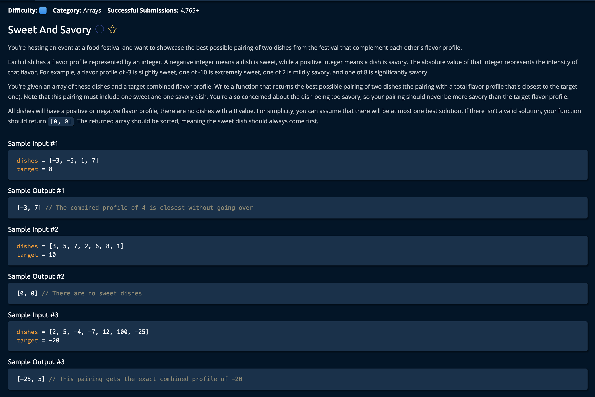

# Sweet And Savory

## Description



## Solution

```py
def sweetAndSavory(dishes, target):
    dishes.sort()
    left = 0
    right = len(dishes) - 1
    result = [0, 0]
    bestMatch = float('inf')
    

    while left < right:
        if dishes[right] < 0 or dishes[left] > 0:
            break
            
        potentialMatch = dishes[left] + dishes[right]
        if potentialMatch > target:
            right -= 1
        else:    
            if target - potentialMatch < bestMatch:
                result = [dishes[left], dishes[right]]
                bestMatch = target - potentialMatch
            left += 1
            
    return result
```

**Time Complexity:** O(nlog(n)) `n` for sorting the arrays<br/>
**Space Complexity:** O(n) for timsort space complexity<br/>

### The Approach

The idea is to sort the array and check the sumof hte first and last element is close to the target value. If it is too big we move the `right` pointer, if it is too small we check if there is a potential match, and then move the `left`.<br>


1. First we sort the input array, set our pointers and initialte our best match to infinity.

```py
dishes.sort()
left = 0
right = len(dishes) - 1
result = [0, 0]
bestMatch = float('inf')
```

2. As long as the left and right pointer don't cross(this would mean we've checked every elemtn in the array). We calculate the potential match of the values at both indeces.

However, before we do this we have to check if the right pointer have crossed into the sweet/savory area of the array( remmeber: Negative values are sweet, positive are savery). If this is true then we can exit the loop because the best match would have already been found. Every other match would become more sweet.

Remember one of the constraints is the user does not want the dish to surpass the target level of sweetness. It is biased to savory.


```py
    while left < right:
        if dishes[right] < 0 or dishes[left] > 0:
            break
            
        potentialMatch = dishes[left] + dishes[right]
```

2. Now we check if the potential match is greater than the target, if not, that means it's too sweet so we move the right pointer over. <br>

```py
if potentialMatch > target:
    right -= 1
```

If it is less than the target that means we can asses if it is better than the best match, we compare and if it is we declare that potentialMatch as the new best match. Finally we increment the left pointer.

```py
else:    
    if target - potentialMatch < bestMatch:
        result = [dishes[left], dishes[right]]
        bestMatch = target - potentialMatch
    left += 1
```

At the end of all of this, once left and right pointers cross or the left/right pointers cross into the savory/sweet index, we can return the result because it holds the best match.

```py
return result
```
and we're **done**!
