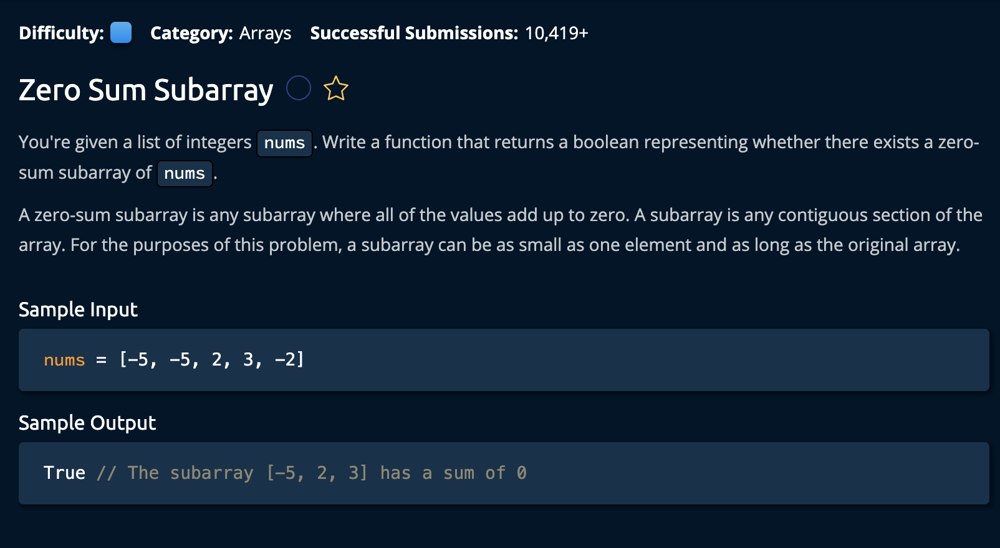

# Zero Sum Subarray

## Description



## Solution

```py
def zeroSumSubarray(nums):
    sums = set([0])
    currentSum = 0

    for num in nums:
        currentSum = currentSum + num
        if currentSum in sums:
            return True
        else:
            sums.add(currentSum)
    
    return False

```

**Time Complexity:** O(n) For iterating through the input array<br/>
**Space Complexity:** O(n) Worst Case for the set that holds the sums<br/>

### The Approach:

The idea is to incrementally add up the values in the array starting from the first index. If at any point the sum equals is the same value twice, we know that a subarray exists. This is because the "net effect" between those numbers/indeces is **Zero**. 

1. First, we create the variables `sums` and `currentSum` to keep track of the sums we calculate while iterating the array.<br>

```py
sums = set([0]) # The set used to remember previously calculated sums
currentSum = 0 # the variable each sum is stored in
```

2. Next, we iterate through the array and calculate the sum, at each point, we check if that sum has been calculated already. If so we return true because there exist a net effect of 0.<br>

```py
    for num in nums:
        currentSum = currentSum + num
        if currentSum in sums:
            return True
```

If not, we add it to the sums valriable to remember for later:

```py
else:
    sums.add(currentSum)
```


3. If we've reached the end the array without finding a duplicate sum value, we return False. ie. There is no subarray.

```py
return False
```

and we're **done**!
