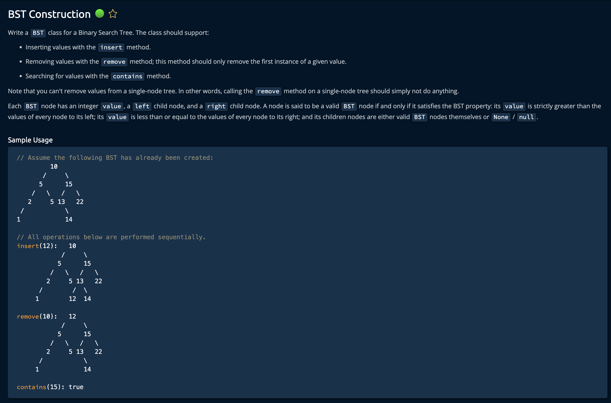

# BST Construction

## Description



## Solution

There are **4 functions** to write in order to complete this problem. We will go over them one at a time and draw a conclusion summarizing our combined algorithms. Ensure you have a solid understanding of how `BST`'s work.

**Time: O(logn)** <br/>
**Space: O(1)** <br/>

### 1. getMinValue()

```py
def getMinValue(self):
    currentNode = self
    while currentNode.left is not None:
        currentNode = currentNode.left
    return currentNode.value
```

`self` - enables the use of class attributes <br>

This is a "Quality of Life" function that finds the minimum value in respect to the node it is currently at. In a `BST` it is understood that the left most node is the smallest Node in that tree/subtree. <br>

So, while currenNode has a left child, we keep traversing left. Once we hit a leaf node (left is None), we return its value since it is guaranteed to be the smallest.

### 1. contains()

```py
def contains(self, value):
    currentNode = self

    while currentNode is not None:
        if value < currentNode.value:
            currentNode = currentNode.left
        elif value > currentNode.value:
            currentNode = currentNode.right
        else:
            return True
    return False
```

`self` - enables the use of class attributes <br>
`value` - the value we are searching for <br>

The **While loop** will go until we have reached a leaf node. It traverses left or right depending on of the target `value` is larger or smaller than the current nodes value. If we find a match, we return **True**. If we reach a `leaf`(currentNode = None) and no match, we return **False**.

### 1. insert()

```py
def insert(self, value):
    currentNode = self

    while True:
        if value < currentNode.value:
            if currentNode.left is None:
                currentNode.left = BST(value)
                break
            else:
                currentNode = currentNode.left
        else:
            if currentNode.right is None:
                currentNode.right = BST(value)
                break
            else:
                currentNode = currentNode.right
    return self
```

`self` - enables the use of class attributes <br>
`value` - the value we are inserting <br>

When inserting in a BST, we start at the root node and traverse down the tree iteratively checking if the value is less than or greater than the current node's value. This will guide us to the correct placement. This is why we have the `while True` condition.<br>

the insert() function essentially traverses from the root to a leaf, comparing the value of each node along the way to ensure the BST condition is maintained.(return self is added for the AlgoExpert.com and not needed for the solution)

### 1. remove()

```py
def remove(self, value, parentNode=None):
    currentNode = self

    while currentNode is not None:
        if value < currentNode.value:
            parentNode = currentNode
            currentNode = currentNode.left
        elif value > currentNode.value:
            parentNode = currentNode
            currentNode = currentNode.right
        else:
            # when the node has 2 children
            if currentNode.left is not None and currentNode.right is not None:
                currentNode.value = currentNode.right.getMinValue()
                currentNode.right.remove(currentNode.value, currentNode)
            # when node is the root node
            elif parentNode is None:
                if currentNode.left is not None:
                    self.value = currentNode.left.value
                    self.right = currentNode.left.right
                    self.left = currentNode.left.left
                elif currentNode.right is not None:
                    self.value = currentNode.right.value
                    self.left = currentNode.right.left
                    self.right = currentNode.right.right
                # for only one value in the tree
                else:
                    return None
            # when the node has 1 children
            elif parentNode.left == currentNode:
                parentNode.left = currentNode.left if currentNode.left is not None else currentNode.right
            elif parentNode.right == currentNode:
                parentNode.right = currentNode.left if currentNode.left is not None else currentNode.right
            break
    return self
```

`self` - enables the use of class attributes <br>
`value` - the value to be removed <br>
`parentNode` - keeps track of the parent of the **currentNode** for reconnecting the subtree of the removed node <br>

The loop runs until **the current node matches the target value** or **we have reached a leaf**. <br>

```py
        self.right = currentNode.right.right
    # for only one value in the tree
    else:
        return None # <------
# when the node has 1 children
elif parentNode.left == currentNode:
    parentNode.left = currentNode.left if currentNode.left is not None
```

```py
while currentNode is not None: # <------
```

The first thing we do is create a variable that will keep track of the current node as we iterate though the BST(`currentNode = self`). Then we implent if statements similar to contains(). If the value is less than current node's value we go left, if greater we go right.

```py
while currentNode is not None:
    if value < currentNode.value:
        parentNode = currentNode
        currentNode = currentNode.left
    elif value > currentNode.value:
        parentNode = currentNode
        currentNode = currentNode.right
...
```

Now, if we have found the value- there are 3 cases to handle:

- when the node has 2 children<br>
- when node when node is the root node<br>
- when the node has 1 children<br>

1. If currentNode has two children:<br>
   We replace its value with the minimum value in its right subtree

```py
currentNode.value = currentNode.right.getMinValue()
```

and remove that minimum node from the right subtree

```py
currentNode.right.remove(currentNode.value, currentNode)
```

2. If currentNode is the root node:<br>

We first check if the root has a left child, if so we replace that root with its left child. If it has no left child we replace it with its right child.

```py
elif parentNode is None:
    if currentNode.left is not None:
        self.value = currentNode.left.value
        self.right = currentNode.left.right
        self.left = currentNode.left.left
    elif currentNode.right is not None:
        self.value = currentNode.right.value
        self.left = currentNode.right.left
        self.right = currentNode.right.right
    # for only one value in the tree
    else:
        return
```

There is an edge case where both left and right are none. This means there is only one node in the tree. In that case we return to indicate removal was successful.

3. If currentNode has 1 child:<br>

We determine if the current node is a left or right node of its parent. After this we set that **parent's.NEWCHILD** to the `currentNode.left` node if it has one, if not then we set it to the `currentNode.right`. <br>

Note that both of these solutions are equivalent:

```py
parentNode.left = currentNode.right if currentNode.right is not None else currentNode.left
parentNode.right = currentNode.left if currentNode.left is not None else currentNode.right
```
