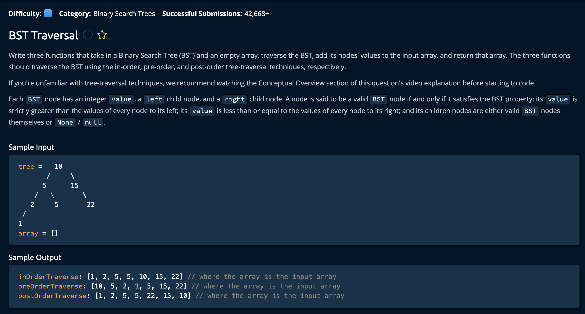

# BST Traversal

## Description



## Solution

The question is asking to traverse the BST in three ways, **In-Order**, **Pre-Order** and **Post-Order.** <br>


**Time: O(n)** for traversing every node in the array<br/>
**Space: O(n)** Because of the array, O(d) for depth of the call stack according to the longest leaf<br/>

### 1. inOrderTraverse(tree, array)

```py
def inOrderTraverse(tree, array):
    if tree is not None:
        inOrderTraverse(tree.left, array) 
        array.append(tree.value)
        inOrderTraverse(tree.right, array) 
    return array
```

As long as the `tree` node is not a leaf, we recursively preform the traversal **In-Order**. Note that the last line "return array" is used to return the final result after the traversal of the tree is complete.<br>

### 2. preOrderTraverse(tree, array)
```py
def preOrderTraverse(tree, array):
    if tree is not None:
        array.append(tree.value)
        preOrderTraverse(tree.left, array) 
        preOrderTraverse(tree.right, array) 
    return array
```

As long as the `tree` node is not a leaf, we recursively preform the traversal in a **Pre-Order** fashion.

### 2. preOrderTraverse(tree, array)
```py
def postOrderTraverse(tree, array):
    if tree is not None:
        postOrderTraverse(tree.left, array) 
        postOrderTraverse(tree.right, array) 
        array.append(tree.value)
    return array
```

As long as the `tree` node is not a leaf, we recursively preform the traversal in a **Post-Order** fashion.