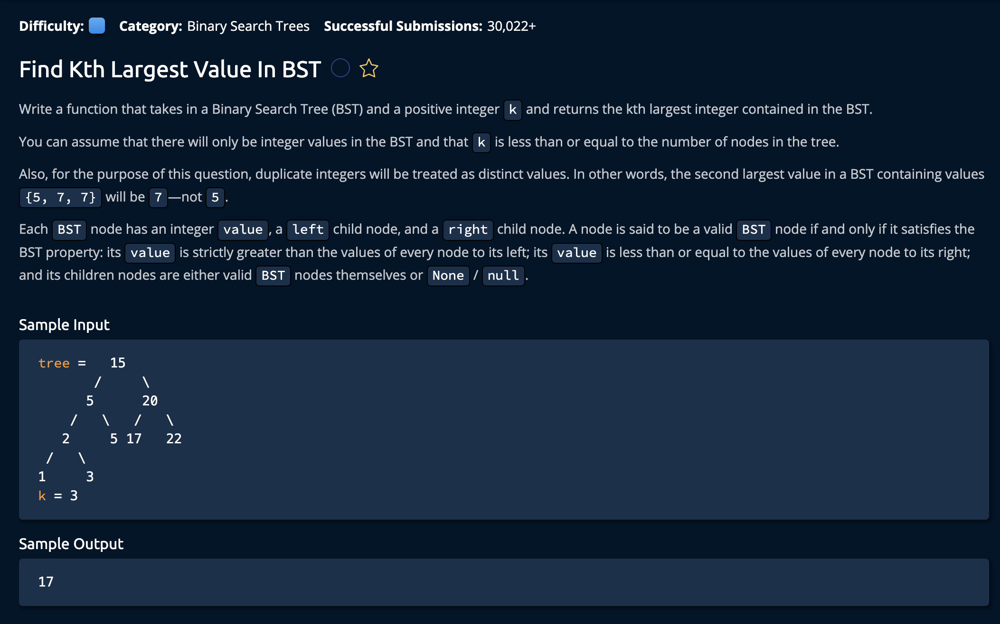

# Find Kth Largest Value In Bst

## Description



## Solution

```py
# This is an input class. Do not edit.
class BST:
    def __init__(self, value, left=None, right=None):
        self.value = value
        self.left = left
        self.right = right

class TreeInfo:
    def __init__(self, numberOfNodesVisited, latestVisitedNodeValue):
        self.numberOfNodesVisited = numberOfNodesVisited
        self.latestVisitedNodeValue = latestVisitedNodeValue
        
def findKthLargestValueInBst(tree, k):
    treeInfo = TreeInfo(0, -1)
    reverseInOrderTraverse(tree, k, treeInfo)
    
    return treeInfo.latestVisitedNodeValue

def reverseInOrderTraverse(node, k, treeInfo):
    if node == None or treeInfo.numberOfNodesVisited >= k:
        return
    reverseInOrderTraverse(node.right, k, treeInfo)
    if treeInfo.numberOfNodesVisited < k:
        treeInfo.numberOfNodesVisited += 1
        treeInfo.latestVisitedNodeValue = node.value
        reverseInOrderTraverse(node.left, k, treeInfo)
```


**Time: O(h + k)** Where `h` is the height of the Binary Tree and `k` is the input value.<br/>
**Space: O(h)** Where `h` is the height of the BST. This represents the space taken up by the call stack<br/>

### The Approach

The idea is to do a reversed-in-order traversal. We start from the largest node, and move backwards. At each node we increment a "node check counter" when that counter equals to `k`, we have found our value.<br>

*Let's brake down the steps.*

1. Create a class to store the info of the node. `numberOfNodesVisited` keeps track of the number of nodes visited, `latestVisitedNodeValue` keeps track of the value at the last visited node. This is for code readability.
```py
class TreeInfo:
    def __init__(self, numberOfNodesVisited, latestVisitedNodeValue):
        self.numberOfNodesVisited = numberOfNodesVisited
        self.latestVisitedNodeValue = latestVisitedNodeValue
```

### findKthLargestValueInBst(tree, k)
- `tree`: This is a pointer to the root node of the tree
- `k`: This the kth largest value we are looking for

2. We initialize tree info to hold 0 nodes visited, and anegative value for the last visited node(remember very value is garunteed to be positive).

```py
def findKthLargestValueInBst(tree, k):
    treeInfo = TreeInfo(0, -1)
    reverseInOrderTraverse(tree, k, treeInfo)
    
    return treeInfo.latestVisitedNodeValue
```
We then perform the reverse-in-order traversal according to the kth largest element. After we perform this, the treeInfo object should hold the kth largest value.

### reverseInOrderTraverse(node, k, treeInfo)
- `node`: This is originally the root node, as the functionis recursively called, the left and right children will be passed down.<br>
- `k`: This the kth largest value we are looking for <br>
- `treeInfo`: The counter and cuurent value variables are updated in the recursive calls.<br>

3. Check if the node is a leaf or if we have visited more than k nodes. If so we end the recursive calls.


We can stop checking if ` treeInfo.numberOfNodesVisited >= k` because starting from the end, we should check at most k nodes.

4. We now can start the reverse traversal. We call the right node, then we check if we have visited k nodes yet, if not we increment the `numberOfNodesVisited` counter and the `latestVisitedNodeValue`.
```py
    reverseInOrderTraverse(node.right, k, treeInfo)
    if treeInfo.numberOfNodesVisited < k:
        treeInfo.numberOfNodesVisited += 1
        treeInfo.latestVisitedNodeValue = node.value
        reverseInOrderTraverse(node.left, k, treeInfo)
```

You can also see we check the left node afterwards. We only have to check the current node and the left node if we have checked less than k nodes.

5. Now, back in the findKthLargestValueInBst() function, we have visited k nodes and can return treeInfo as it hold the info we need.

```py
return treeInfo.latestVisitedNodeValue
```
and we're **Done!**