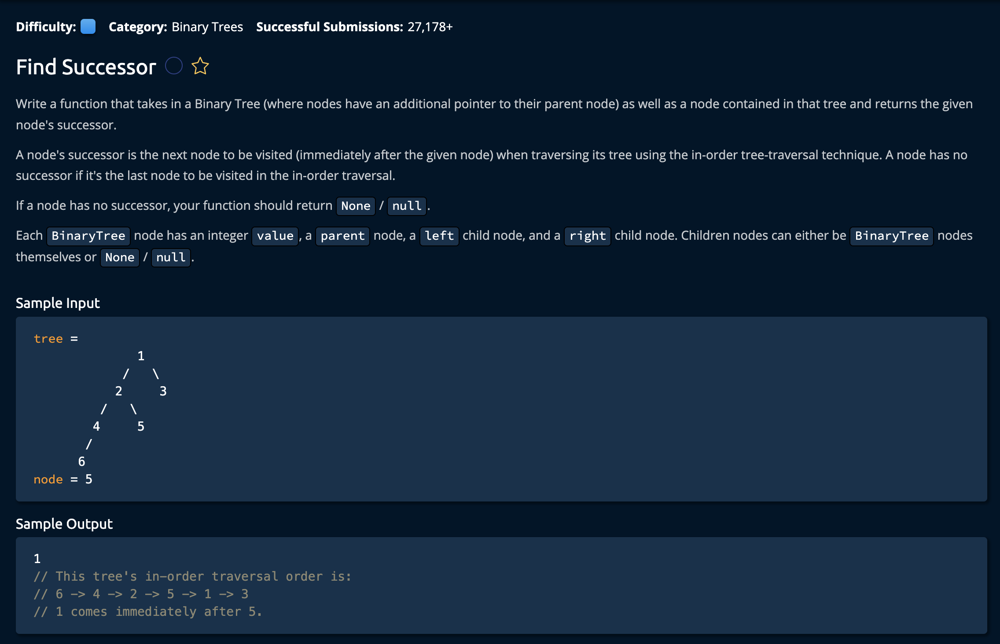

# Find Successor

## Description



## Solution

```py
# This is an input class. Do not edit.
class BinaryTree:
    def __init__(self, value, left=None, right=None, parent=None):
        self.value = value
        self.left = left
        self.right = right
        self.parent = parent
# This is an input class. Do not edit.

def findSuccessor(tree, node):
    if node.right is not None:
        return getLeftmostChild(node.right)
    
    return getRightMostParent(node)

def getLeftmostChild(node):
    currentNode = node
    while currentNode.left is not None:
        currentNode = currentNode.left

    return currentNode

def getRightMostParent(node):
    currentNode = node
    while currentNode.parent is not None and currentNode.parent.right == currentNode:
        currentNode = currentNode.parent

    return currentNode.parent
```


**Time: O(h)** Where `h` is the height of the Binary Tree.<br/>
**Space: O(1)**<br/>

### The Approach

The idea is to address two cases that exist when finding the next successor:

- If there is a right child: get the leftmost child of the right node
- If there is no right child: get the rightmost parent of that current node

We know that based on in-order traversal, the next node would be one of these nodes dependong on whcih cases we encounter. So, our algoritm forst checks if there is a right node, then finds the leftmost child of it. If it doesnt have a right node, we find the rightmost parent and return it to the user.

*Let's brake down the steps.*

1. Check if there is a right node, if so get its leftmost child.
```py
def findSuccessor(tree, node):
    if node.right is not None:
        return getLeftmostChild(node.right)
```

### getLeftmostChild(node)
- `node`: This is the right child of the node we are currently looking at.

2. To find the leftmost child, we move down the tree as long as the child is not equal to **None**. Then we return that node.

```py
def getLeftmostChild(node):
    currentNode = node
    while currentNode.left is not None:
        currentNode = currentNode.left

    return currentNode # this will be returned to the user
```

3. Now, if there is no right child, the successer must be the rightmost parent.

### getRightMostParent(node)
- `node`: This is the node we are currently looking at. <br>

As long as the parent Node is not None and our current node is the right child of that parent, we move up the tree. 
```py
def getRightMostParent(node):
    currentNode = node
    while currentNode.parent is not None and currentNode.parent.right == currentNode:
        currentNode = currentNode.parent
    return currentNode.parent
```
We have the condition: `currentNode.parent.right == currentNode` because if there is ever a case where `currentNode.parent.left == currentNode` the successor  is garuenteed to be teh parent.<br>

So, that wraps up the two cases we will encounter, either we return `return getLeftmostChild(node.right)` or we `return getRightMostParent(node)`. <br>

and we're **Done!**