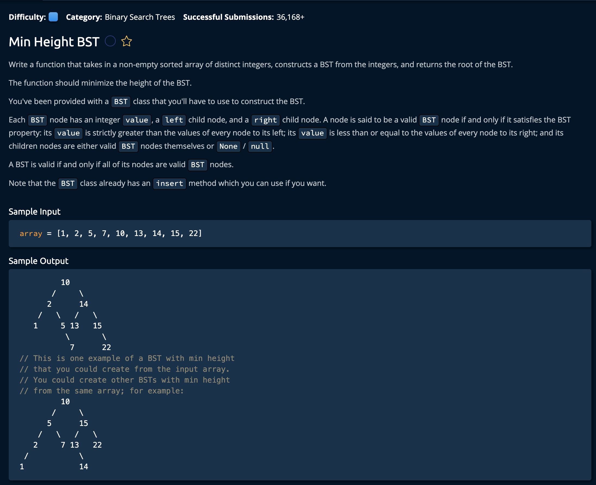

# Min Height Bst

## Description



## Solution

```py
def minHeightBst(array):
    return constructMinHeightBst(array, None, 0, len(array) - 1)

def constructMinHeightBst(array, bst, startIdx, endIdx):
    if endIdx < startIdx:
        return

    middleIdx = (startIdx + endIdx) // 2
    newBstNode = BST(array[middleIdx])
    if bst is None:
        bst = newBstNode
    else:
        if array[middleIdx] < bst.value:
            bst.left = newBstNode
            bst = bst.left
        else:
            bst.right = newBstNode
            bst = bst.right
    constructMinHeightBst(array, bst, startIdx, middleIdx - 1)
    constructMinHeightBst(array, bst, middleIdx + 1, endIdx)
    return bst
```


**Time: O(n)** for traversing every index in the array<br/>
**Space: O(n)** because the `BST` Created us the same size as the array<br/>

### The Approach

We will implement a recursive solution. The idea is that we **(1)** take a range of indeces(initialted as the first and last index), **(2)** find the middle mode, and **(3)** return it. We will start at the root node, find the middle then find the middle of the **left** and **right** sections.

1. Implement the recursive function with its parameters
```py
def minHeightBst(array):
     # def constructMinHeightBst(array, bst, startIdx, endIdx)
    return constructMinHeightBst(array, None, 0, len(array) - 1)
```
- `array`: This is the **input array** we will be separet the half-sized sub-arrays
- `bst`: This will start as the root node, over time we will add more and more nodes to it
- `startIdx`: This is the **left** edge of the range
- `endIdx`: This is the **right** edge of the range

2. Now we define the **constructMinHeightBst()** function with its base case

```py
def constructMinHeightBst(array, bst, startIdx, endIdx):
    if endIdx < startIdx: # at this point we've visited every index in halfed-sub-array
        return
```

3. Now we calculate the middle index based on the `startIdx` and `endIdx` and create a BST Object from it.
```py
middleIdx = (startIdx + endIdx) // 2
newBstNode = BST(array[middleIdx]) # BST object with the value from the middle index
```

4. Now we determine how the BST object is inserted into `bst`. If the Value is *none*, we initialise the `bst` with the value `newBstNode`, if the `middleIdx` is greater than the current `bst` value we insert `newBstNode` into the **right** subtree, otherwise we intert it to the **left** subtree.
```py
if bst is None:
    bst = newBstNode
else:
    if array[middleIdx] < bst.value:
        bst.left = newBstNode
        bst = bst.left # updates the bst value for the next insertion
    else:
        bst.right = newBstNode
        bst = bst.right # updates the bst value for the next insertion
```

Note: we update the bst node to **left** or **right** so that when we recursively call this function, the next insertion will happen based on that newly inserted node, rather than trying to insert from the root node everytime.

5. Now we do the recursive calls on the left and right subtree, note that at some point, where will be only one or no nodes in either subtree, so our base case will simly return.
```py
constructMinHeightBst(array, bst, startIdx, middleIdx - 1) # for the left
constructMinHeightBst(array, bst, middleIdx + 1, endIdx) # for the right
```
6. Finally return `bst`
```py
return bst
```
and we're **Done!**