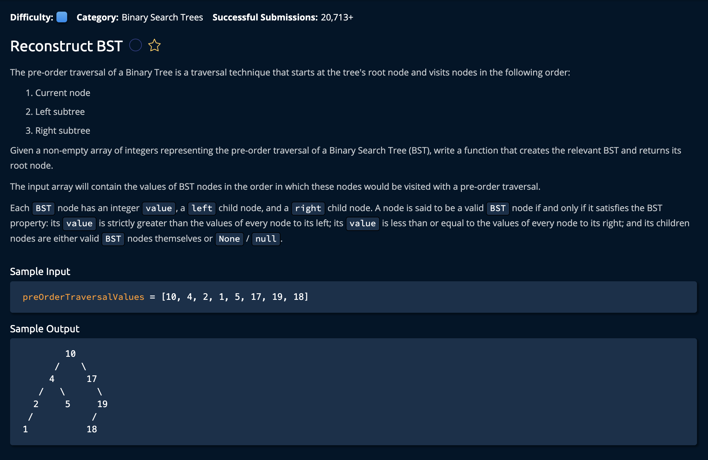

# Reconstruct BST

## Description



## Solution

```py
# This is an input class. Do not edit.
class BST:
    def __init__(self, value, left=None, right=None):
        self.value = value
        self.left = left
        self.right = right

class TreeInfo:
    def __init__(self, rootIdx):
        self.rootIdx = rootIdx


def reconstructBst(preOrderTraversalValues):
    treeInfo = TreeInfo(0)
    return reconstructBSTFromRange(float('-inf'),float('inf'), preOrderTraversalValues, treeInfo)

def reconstructBSTFromRange(lowerBound, upperBound, preOrderTraversalValues, currentSubtreeInfo):
    if currentSubtreeInfo.rootIdx == len(preOrderTraversalValues):
        return None
        
    rootvalue = preOrderTraversalValues[currentSubtreeInfo.rootIdx]
    if rootvalue < lowerBound or rootvalue >= upperBound:
        return None

    currentSubtreeInfo.rootIdx += 1
    leftSubtree = reconstructBSTFromRange(lowerBound, rootvalue, preOrderTraversalValues, currentSubtreeInfo)
    rightSubtree = reconstructBSTFromRange(rootvalue, upperBound, preOrderTraversalValues, currentSubtreeInfo)  

    return BST(rootvalue, leftSubtree, rightSubtree)
```


**Time: O(n)** for traversing every node/index in the sarray<br/>
**Space: O(h)** where`h` is the height of the tree<br/>

### The Approach

We will implement a recursivve solution that checks if the following node(the node to the right) falls within a range determined by the previous nodes. We know that if a node = 5, the node to its right has to be larger and the node to its left has to be smaller. <br>

We also know that if a node is a left child, then every element below it must be smaller than its parent. And if it is a right child every node below it must be larger than the parent. <br>

We use this info to create a range for what the **left** and **right** children of any given `node` should be.

1. Create a class that holds the `rootIdx`, this basically behaves like a global variable. This will be the current node we currently look at while traversing the tree.
```py
class TreeInfo:
    def __init__(self, rootIdx):
        self.rootIdx = rootIdx
```

### reconstructBst(preOrderTraversalValues)
2. Now we create a reconstructBst() that takes the array of values. We initialize the node as the first index of the array. We can do this because for any tree, the root is always the first node.

```py
def reconstructBst(preOrderTraversalValues):
    treeInfo = TreeInfo(0)
    return reconstructBSTFromRange(float('-inf'),float('inf'), preOrderTraversalValues, treeInfo)
```
You can see we also initialize the range to infinity because for the first node, there are no restrictions to how large or how small the children can be.

### reconstructBSTFromRange(lowerBound, upperBound, preOrderTraversalValues, currentSubtreeInfo)
`lowerBound`- This is the lowerbound restriction for our left or right child
`upperBound`- This is the upperbound restriction for our left or right child
`preOrderTraversalValues`- This the array of integers we are observing to create the BST
`currentSubtreeInfo`- This is the global variable we are using to keep track of what node we are looking at

3. We define our first base case, which is when we have reached the end of teh array.

```py
def reconstructBSTFromRange(lowerBound, upperBound, preOrderTraversalValues, currentSubtreeInfo):
    if currentSubtreeInfo.rootIdx == len(preOrderTraversalValues):
        return None
```

4. We then find what value at the node we are currently at. If it is outside the range we end the current revursive call.
```py
    rootvalue = preOrderTraversalValues[currentSubtreeInfo.rootIdx]
    if rootvalue < lowerBound or rootvalue >= upperBound:
        return None
```

5. If it falls within our current range, we move the pointer variable(`currentSubtreeInfo.rootIdx`) to the left. Then we make our recursive calls with our updated ranges on the left and right children
```py
    currentSubtreeInfo.rootIdx += 1
    leftSubtree = reconstructBSTFromRange(lowerBound, rootvalue, preOrderTraversalValues, currentSubtreeInfo)
    rightSubtree = reconstructBSTFromRange(rootvalue, upperBound, preOrderTraversalValues, currentSubtreeInfo) 
```
Note that the range for the left subtree is from the previous `lowerBound` to the *value* of the current node. The of the right subtree is fron the current *value* and the prevous `upperbound` 

6. Finally return that rootValue along side the left and rigth subtrees back to the function caller.
```py
 return BST(rootvalue, leftSubtree, rightSubtree)
```
and we're **Done!**