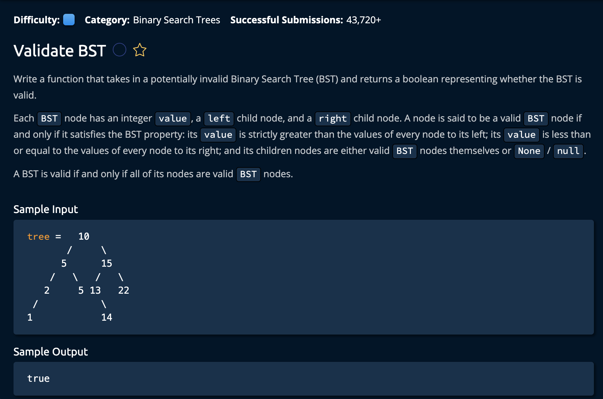

# Validate BST

## Description



## Solution

```py
def validateBst(tree, min_val=float('-inf'), max_val=float('inf')):
    if tree is None:
        return True
    if not (min_val <= tree.value < max_val):
        return False
    return validateBst(tree.left, min_val, tree.value) and validateBst(tree.right, tree.value, max_val)
```

tree - initially the root node, is the current observed node.
min_val - this is the minimum allowed value for the current subtree. Initially it is negative infinity for the whole tree.
max_val - this is the maximum allowed value for the current subtree. Initially it is positive infinity for the whole tree.
**Time: O(logn)** <br/>
**Space: O(1)** <br/>

The idea is to traverse through the tree recersively. At each node,
