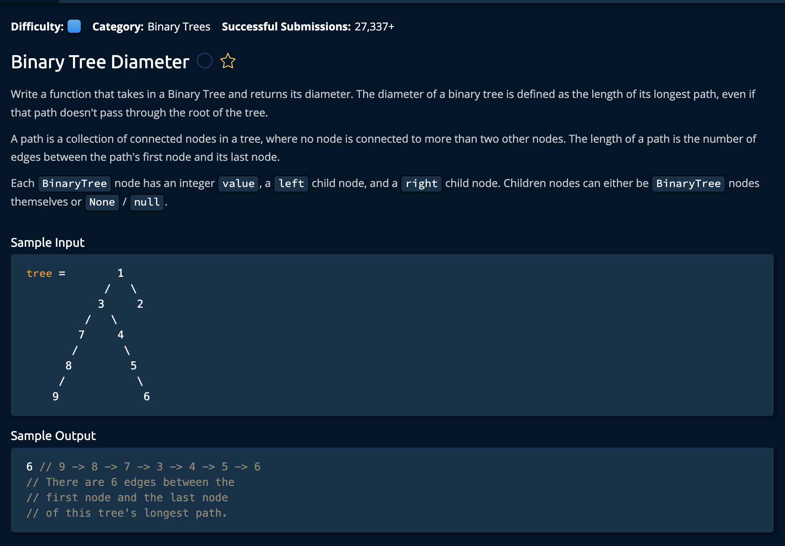

# Binary Tree Diameter

## Description



## Solution
```py
class BinaryTree:
    def __init__(self, value, left=None, right=None):
        self.value = value
        self.left = left
        self.right = right


def binaryTreeDiameter(tree):
    return getTreeInfo(tree).diameter

def getTreeInfo(tree):
    if tree is None:
        return TreeInfo(0, 0)

    leftTreeInfo = getTreeInfo(tree.left)
    rightTreeInfo = getTreeInfo(tree.right)

    longestPathThroughRoot = leftTreeInfo.height + rightTreeInfo.height
    maxDiameterSoFar = max(leftTreeInfo.diameter, rightTreeInfo.diameter)
    currentDiameter = max(longestPathThroughRoot, maxDiameterSoFar)
    currentHeight = 1 + max(leftTreeInfo.height, rightTreeInfo.height)
    return TreeInfo(currentDiameter, currentHeight)

class TreeInfo:
    def __init__(self, diameter, height):
        self.diameter = diameter
        self.height = height
```

**Time Complexity:** O(n) for iterating through every node in the `tree`<br/>
**Space Complexity:** O(n) Worst Case Scenario where the tree resembles a linkedlist<br/>

### Approach

The idea is to iterate through every node in the tree using **DFS**. At each point, we compare the **longest Path** and the **maxDiameter** of the two subtrees. Whichever is the longer will be selected as the `currentDiameter`.<br>

As we reach the base case(tree is none: ie we've reached a leaf node), our recursive calls start to return as we propogate back up the recursive call stack(while adding one to the height at each step). This is how the height of each node is calulated.<br>


*Let's break it down step by step.*

1. We create an class for code readability. This class holds two propeties, the diameter and height of a current node. We will incrememnt the height as we travers the recursive call stack. The diameter will end up being the currentDiameter for each node.
```py
class TreeInfo:
    def __init__(self, diameter, height):
        self.diameter = diameter
        self.height = height
```

2. We create our base case, which is when we are at a leaf node. ie `tree == None`.

```py
def getTreeInfo(tree):
    if tree is None:
        return TreeInfo(0, 0)
```

3. We *recursively* call this function on the left and right sub trees. It will add the height of the two sibtrees and save it in `longestPathThroughRoot`.
```py
    leftTreeInfo = getTreeInfo(tree.left)
    rightTreeInfo = getTreeInfo(tree.right)

    longestPathThroughRoot = leftTreeInfo.height + rightTreeInfo.height
```

4. Next we find the max diameter of the two subtrees. We will take the larger of the two and compare it to the `longestPathThroughRoot` to determine our currentDiameter for the Node we are at right now.

```py
    maxDiameterSoFar = max(leftTreeInfo.diameter, rightTreeInfo.diameter)
    currentDiameter = max(longestPathThroughRoot, maxDiameterSoFar)
```

5. Next we add 1 to the height to the larger of the two child nodes, this is to ensure we get the maximum height based on this subtree. We then return the treeInfo object with the `currentDiameter` and the `currentHeight`.<br>

Note that this returns a `TreeInfo` object.

```py
    currentHeight = 1 + max(leftTreeInfo.height, rightTreeInfo.height)
    return TreeInfo(currentDiameter, currentHeight)
```

6. Finally, we invoke the above logic in a parent function binaryTreeDiameter() and return the *diameter* property of the `TreeInfo` object.

```py

def binaryTreeDiameter(tree):
    return getTreeInfo(tree).diameter
```

and we're **Done!**