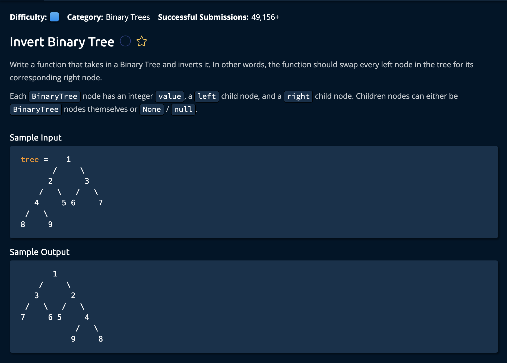

# Invert Binary Tree

## Description



## Solution
```py
def invertBinaryTree(tree):
    if tree == None:
        return

    tree.left, tree.right = tree.right, tree.left
    invertBinaryTree(tree.left)
    invertBinaryTree(tree.right)
    
    return

# This is the class of the input binary tree.
class BinaryTree:
    def __init__(self, value):
        self.value = value
        self.left = None
        self.right = None
```

**Time Complexity:** O(n) for performing constant time operations on every node in the tree<br/>
**Space Complexity:** O(d) where **d** is the depth of the tree: for the recursive calls on the call stack <br/>

### Approach

The idea is similar to recursively traversing a tree. We perform the same logic on every node: <br> 

- End the recursion if we are at a leaf node, if not..
- Swap the values of the left and right children

Simple as that!


1. We create our base case, which is when we are at a leaf node. ie `tree == None`.

```py
def invertBinaryTree(tree):
    if tree == None:
        return
```

2. If we are not at a leaf node we swap the values of the two children(even if the are both None)

```py
tree.left, tree.right = tree.right, tree.left
```

3. This is where we revursively call the same function to do the same thing on the two previosuly swapped children.

```py
invertBinaryTree(tree.left)
invertBinaryTree(tree.right)

return
```

and we're **Done!**