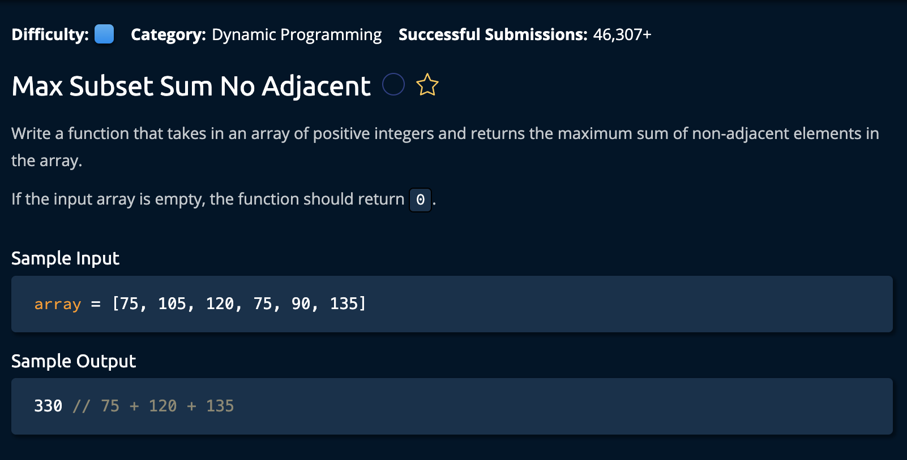

# Max Subset Sum No adjacent Value

## Description



## Solution

```py
def maxSubsetSumNoAdjacent(array):
    if len(array) == 0:
        return 0
    elif len(array) == 1:
        return array[0]

    prevMax = array[0]
    currentMax = max(array[0], array[1])

    for i in range(2, len(array)):
        newMax = max(currentMax, prevMax + array[i])
        prevMax = currentMax
        currentMax = newMax
    
    return currentMax
```

**Time Complexity:** O(n) `n` for iterating through every element the array<br/>
**Space Complexity:** O(1)<br/>

### Approaching The Solution

The idea is to iterate through the array, finding the max sum at each index using a derived formula.<br>

```py
#  MaxSum = max(currentMax, previousMax + currentNumber)
```

We know that if we find the maximum sum at a current index, the next (potential)Max can be found by comparing the max sum from **1** indeces before with the sum of the value at the current index with the max sum from **2** indeces before. 

```py
#  0  1   2   3   4   <- Indeces
# [7, 10, 17, 7,   9] <- Values
# [7, 10, 19, 19, 28] <- Max Sums at each index
# 19 at index 3 = max(10 + 7,19)
# 28 = max(19 + 9,19)
```

There are two base cases: 
- The max sum of the first number is the number itself
- The max sum of the first two numbers is the larger number of the two.

```py
    prevMax = array[0]
    currentMax = max(array[0], array[1])
```
After defining our base cases we apply the algorithm described above, then update the prevMax and CurrentMax to reflect the updated calciulations.
```py
for i in range(2, len(array)): # note we start at the 3rd element due to the base cases
    newMax = max(currentMax, prevMax + array[i])
    prevMax = currentMax
    currentMax = newMax
    
```
Finally we return the current max.
```py
return currentMax
```

and we're **Done!**
