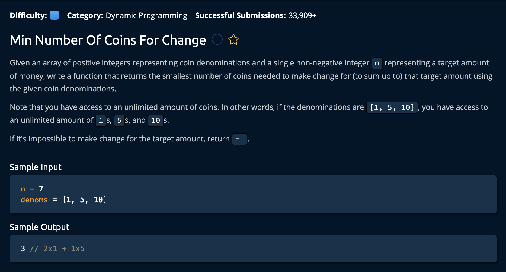

# Min Number Of Coins For Change

## Description



## Solution

```py
def minNumberOfCoinsForChange(n, denoms):
    numOfCoins = [float("inf") for _ in range(n + 1)]
    numOfCoins[0] = 0

    for denom in denoms:
        for amount in range(len(numOfCoins)):
            if denom <= amount:
                numOfCoins[amount] = min(numOfCoins[amount], 1 + numOfCoins[amount - denom])
    
    return numOfCoins[n] if numOfCoins[n] != float("inf") else - 1 
```

**Time Complexity:** O(n * D) `n` is the amount of denominations given and `D` is the change we want to create<br/>
**Space Complexity:** O(1)<br/>

### Approaching The Solution

The idea is to create an array that is the size of n + 1. We add 1 so that we can include the change amount of 0- which is our base case. After this, we compare every denomination and see how many coins we use to create ever amount o change from 0 to n. At denomination point we compare the minimum change between the two and set that as the new "minimum value" for that change amount.<br>


1. Create the array that has the length of n+1 and initialize the 0 index to 0.

```py
numOfCoins = [float("inf") for _ in range(n + 1)]
numOfCoins[0] = 0 # It takes zero coins to make zero change
```

2. Iterate through the denom array, at each point we iterate through the numOfCoins array and check if the denom is smaller than or equal to the amount(this is how we know if we can use that coin to create that current amount of change)

```py
for denom in denoms:
    for amount in range(len(numOfCoins)):
        if denom <= amount:
            numOfCoins[amount] = min(numOfCoins[amount], 1 + numOfCoins[amount - denom])
```

3. If `denom <= amount` we compare the minimum of the amount currently stored at that change amount with the change amount stored at `amount - denom` + 1. We add one because we used the current denom coin once.

```py
numOfCoins[amount] = min(numOfCoins[amount], 1 + numOfCoins[amount - denom])
```

4. We return numOfCoins[n] only if its value is not infinity, if it is that means we havent found any ways to make that amount of change.

```py
return numOfCoins[n] if numOfCoins[n] != float("inf") else - 1 
```

and we're **Done!**
